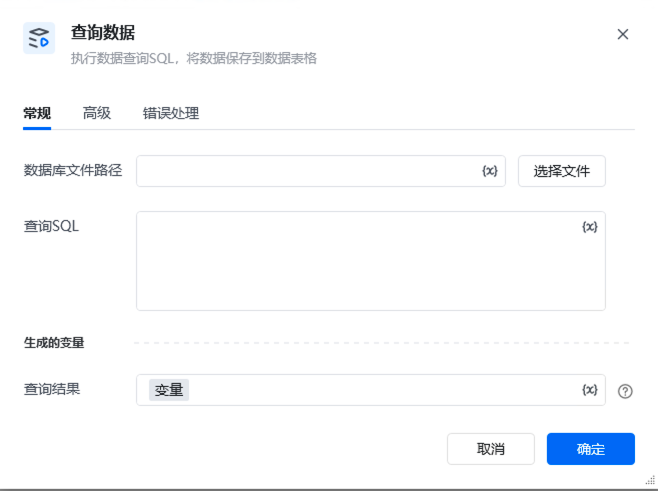
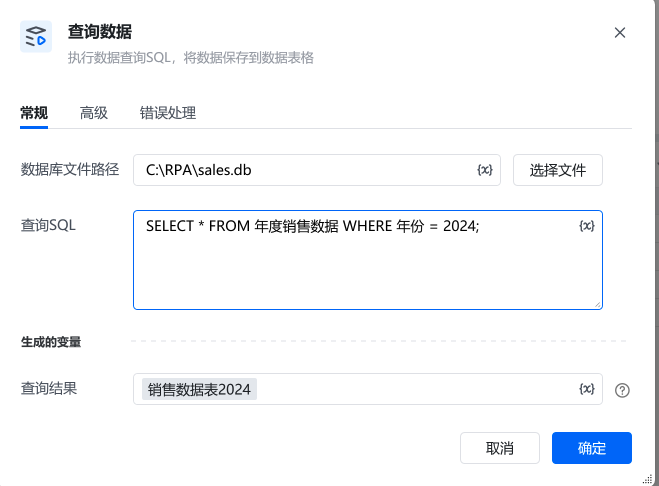

## 一、指令用途

该指令用于对本地SQLite 3数据库执行 SQL 查询，并将查询结果保存为数据表格变量，以便后续流程直接调用。

## 二、参数说明

参数说明<strong>数据库文件路径</strong>用于指定本地数据库文件（.db）的完整路径。可点击「选择文件」按钮，通过可视化界面选择目标文件。<strong>查询 SQL</strong>输入符合目标数据库语法的 SQL 查询语句，例如：SELECT * FROM 产品表 WHERE 库存数量 > 0<strong>查询结果</strong>指定一个变量名称（默认值为「变量」），查询结果会以表格形式保存到该变量中，后续流程可直接读取变量中的数据进行处理。

## 三、使用示例

在「数据库文件路径」中，点击「选择文件」，选择本地的 sales.db 文件。在「查询 SQL」中输入：将「查询结果」保存到变量「销售数据2024」中。后续流程可通过「销售数据2024」变量，读取并分析销售记录，用于生成年度报表。

## 四、注意事项

<Info>
  使用指令过程中遇到问题？前往 [八爪鱼RPA 开发者社区问答板块](https://rpa.bazhuayu.com/community/questions) 提问，获取官方与社区帮助。
</Info>
