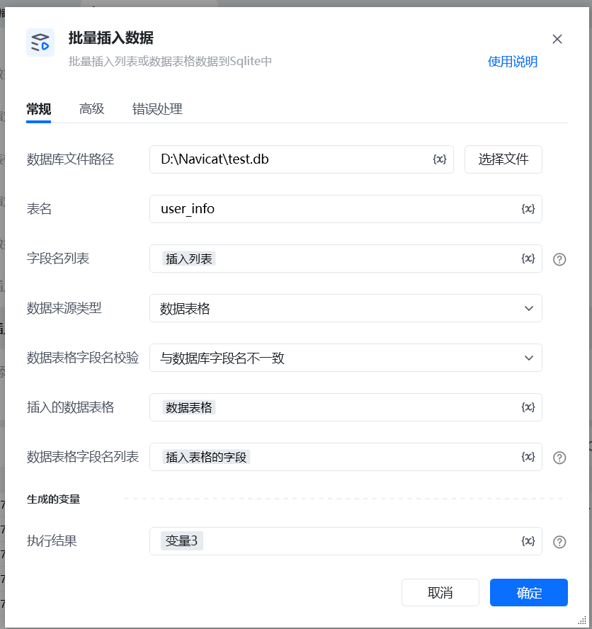
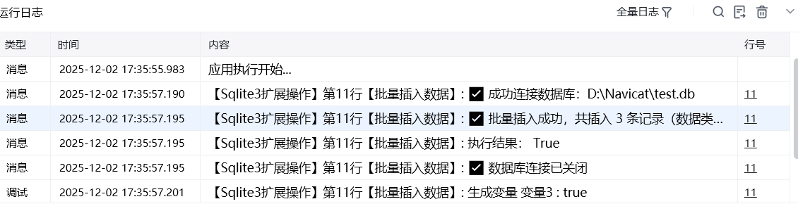

# 指令文档：批量插入数据
## 一、指令概述

批量插入列表或数据表格数据到Sqlite中

## 二、调用参数配置参数名称描述配置规则备注数据库文件路径SQLite 数据库文件的本地路径输入文件路径（如C:/data/db.sqlite），或点击 “选择文件” 按钮选取必填表名数据库中待插入数据的目标表名称输入目标表的名称（如user_info），需与数据库中表名完全一致必填数据源类型待插入数据的来源格式下拉选择数据源类型（如 “数据列表”“数据表格” 等，根据实际支持的格式选择）必填数据表格字段名校验配置字段名与数据库表的匹配规则下拉选项：- 与数据库字段名一致- 与数据库字段名不一致必填字段名列表Sqlite中要插入的字段名列表输入字段名列表，格式为文本值列表（多个用英文逗号分隔，如 ["id","name"]）必填数据表格字段名列表待插入数据表格中的字段名列表（仅用于字段映射）当数据表格字段名与数据库字段名不一致时填写，数据表格字段名列表和字段名列表的顺序和数量必须一致必填（仅 “不一致” 规则下可空）插入的数据列表待插入的具体数据（二维列表格式）输入二维列表变量（如[[1,"张三",20],[2,"李四",25]]），内部列表的元素顺序需与 “字段名列表” 对应当数据源类型为 “列表” 时必填插入的数据表格待插入的具体数据（数据表格格式）选择或输入数据表格变量，表格结构需与 “数据表格字段名列表”（或默认字段）匹配当数据源类型为 “表格” 时必填生成的变量 / 执行结果存储插入操作的结果信息（如成功条数、错误信息）自定义变量名（如 “插入结果”）选填
## 三、校验规则细节说明
1. 当 “数据表格字段名校验” 选择 “与数据库字段名一致” 时：数据表格的字段名需与数据库表的字段名完全相同；字段名列表”<strong>必须填写</strong>，且顺序、数量需与数据表格的实际字段一致；
2. 当选择 “与数据库字段名不一致” 时：数据表格字段名与数据库表字段名可不同，通过 “字段名列表” 与 “数据表格字段名列表” 建立映射关系；
## 四、使用示例
示例 1：字段名与数据库一致数据库文件路径：C:/db/test.db；表名：product（数据库字段：id,product_name,price）；数据源类型：数据表格；字段名校验：与数据库字段名一致；字段名列表：["id","product_name","price"]（与数据表格实际字段顺序一致）；插入的数据表格：选择包含上述字段的商品表格；执行后，表格数据将按字段名匹配插入到product表中。
示例 2：字段名与数据库不一致数据库文件路径：C:/db/test.db；表名：user（数据库字段：id,name,age）；数据源类型：数据表格；字段名校验：与数据库字段名不一致；字段名列表：["id","name","age"]；数据表格字段名列表：["用户ID","姓名","年龄"]（与数据列表顺序对应）；插入的数据表格数据：[[1,"张三",20],[2,"李四",25]]（顺序对应用户ID,姓名,年龄）；执行后，数据将按映射关系（用户ID→id、姓名→name、年龄→age）插入到user表中。
## 五、运行效果

指令执行后，将批量插入数据到指定 SQLite 表中，生成的变量 / 执行结果将返回插入成功的条数、失败原因（若有）等信息，便于后续流程判断插入是否成功。

六、注意事项“数据库文件路径” 需确保文件存在且有读写权限，否则会提示 “文件无法访问”；“表名” 和 “字段名列表” 需与数据库中的实际表结构一致（区分大小写），否则会导致插入失败；数据列表 / 表格的每行数据长度需与 “字段名列表” 的长度一致，避免 “列数不匹配” 错误；当插入大批量数据时，建议在 “高级” 选项中配置批量提交条数（如每 1000 条提交一次），提升插入效率。

<Info>
  使用指令过程中遇到问题？前往 [八爪鱼RPA 开发者社区问答板块](https://rpa.bazhuayu.com/community/questions) 提问，获取官方与社区帮助。
</Info>
