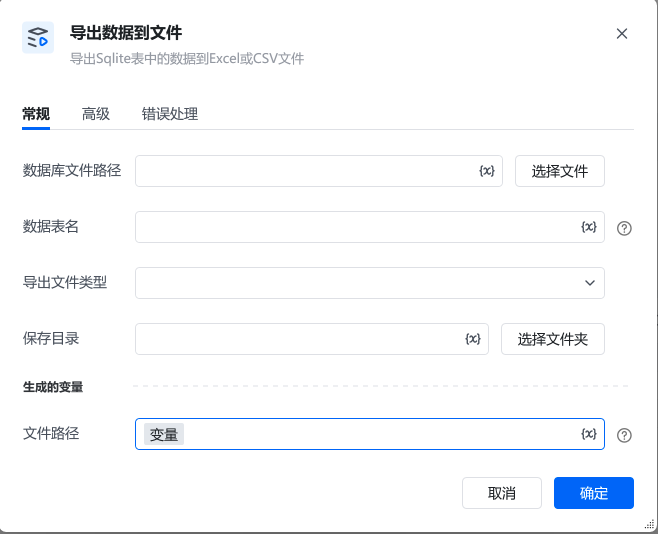

## 一、指令概述

该指令用于将本地 SQLite 3数据库表中的数据导出为 Excel 或 CSV 文件，方便进行数据备份、分析或分享。

## 二、参数说明

参数说明<strong>数据库文件路径</strong>指定本地 SQLite 数据库文件（如 .db）的完整路径。可点击「选择文件」按钮，通过可视化界面选择目标数据库文件。<strong>数据表名</strong>输入要导出数据的目标表名称（如 年度销售数据），确保该表在指定数据库中存在。<strong>导出文件类型</strong>选择导出文件的格式，支持 <strong>Excel</strong>（如 .xlsx）和 <strong>CSV</strong>（逗号分隔文本）两种类型。<strong>保存目录</strong>指定导出文件的保存路径。可点击「选择文件夹」按钮，可视化选择目标文件夹，需确保该目录有写入权限。<strong>文件路径</strong>指定一个变量名称（默认值为「变量」），导出完成后，文件的完整路径会保存到该变量中，后续流程可通过此变量引用该文件。

## 三、使用示例

<Info>
  使用指令过程中遇到问题？前往 [八爪鱼RPA 开发者社区问答板块](https://rpa.bazhuayu.com/community/questions) 提问，获取官方与社区帮助。
</Info>
