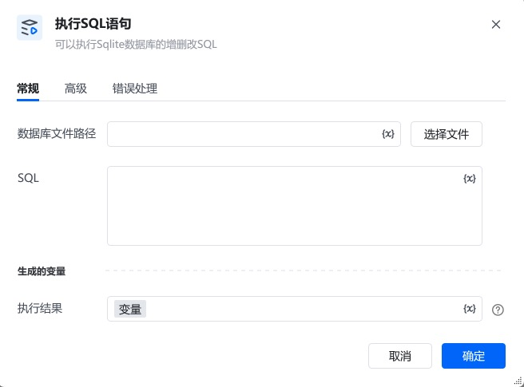

## 一、指令用途

该指令用于对本地 SQLite  3数据库文件执行增、删、改等非查询类 SQL 语句，例如 INSERT、UPDATE、DELETE、CREATE TABLE 等，完成对数据库的写入、修改或结构变更操作，并可将执行结果保存到变量中。

## 二、参数说明

参数说明<strong>数据库文件路径</strong>指定本地 SQLite 数据库文件（如 .db）的完整路径。可点击「选择文件」按钮，通过可视化界面选择目标文件。<strong>SQL</strong>输入需要执行的 SQL 语句，例如：插入数据：INSERT INTO 年度销售数据 (商品ID, 商品名称, 年份, 销量, 总金额) VALUES ('SP005', '平板电脑', 2024, 500, 150000.00)•更新数据：UPDATE 年度销售数据 SET 销量 = 1600 WHERE 商品ID = 'SP001' AND 年份 = 2024•删除数据：DELETE FROM 年度销售数据 WHERE 商品ID = 'SP004' AND 年份 = 2024•创建表：CREATE TABLE IF NOT EXISTS 库存表 (商品ID TEXT, 库存数量 INTEGER) <strong>执行结果</strong>结果为布尔值，指定一个变量名称（默认值为「变量」），执行结果会保存到该变量中。 |

三、使用示例在「数据库文件路径」中，点击「选择文件」，选择本地的 sales.db 文件。在「SQL」中输入：INSERT INTO 年度销售数据 (商品ID, 商品名称, 年份, 销量, 总金额) VALUES('SP005','平板电脑',2024,500,150000.00)将「执行结果」保存到变量「插入结果」中。后续流程可通过「插入结果」变量判断插入是否成功。

四、注意事项确保指定的数据库文件路径正确，且文件具备读写权限。如需执行查询类 SQL（如 SELECT），应使用「查询数据」指令，而非本指令。

<Info>
  使用指令过程中遇到问题？前往 [八爪鱼RPA 开发者社区问答板块](https://rpa.bazhuayu.com/community/questions) 提问，获取官方与社区帮助。
</Info>
