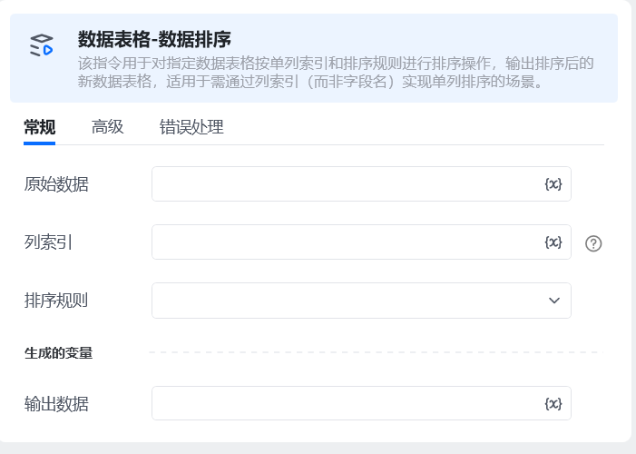
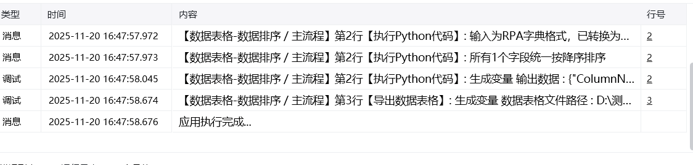

## 一、指令概述

该指令用于对指定数据表格<strong>按单列索引</strong>和排序规则进行排序操作，输出排序后的新数据表格，适用于需通过列索引（而非字段名）实现单列排序的场景。

## 二、调用参数配置参数名称显示名称描述控件类型校验格式示例原始数据原始数据选择待排序的源数据表格输入框必填-列索引列索引填写待排序的列索引（从 0 开始，数据类型为文本值），如 0（第一列）、2（第三列）输入框必填0排序规则排序规则选择排序方式（升序 / 降序）下拉框必填-输出数据输出数据配置排序后的数据表格存储变量输入框必填-
## 三、使用示例

假设存在一个包含 “ID、姓名、成绩” 三列的表格（列索引分别为 0、1、2），需按 “成绩” 列（列索引 2）降序排列，配置如下：原始数据：选择目标表格变量列索引：2排序规则：选择 “降序”输出数据：配置为排序后成绩表
## 四、运行效果

执行指令后，“排序后成绩表” 变量将存储按 “成绩列（列索引 2）降序” 排列后的表格，数据行顺序随列索引和排序规则变化。

五、注意事项列索引需为非负整数，且不得超过原始数据表格的列数减 1（如 3 列表格，列索引最大为 2），否则会触发索引越界错误；仅支持<strong>单列索引</strong>排序，若需多列排序，需多次调用该指令或结合其他多列排序指令；确保 “原始数据” 为合法数据表格格式，空表或非表格数据会导致指令执行失败。
## 六、延伸应用

可与 “数据表格列操作” 指令配合，先通过列索引定位目标列并验证数据类型，再执行排序，保障数据处理的准确性。

<Info>
  使用指令过程中遇到问题？前往 [八爪鱼RPA 开发者社区问答板块](https://rpa.bazhuayu.com/community/questions) 提问，获取官方与社区帮助。
</Info>
