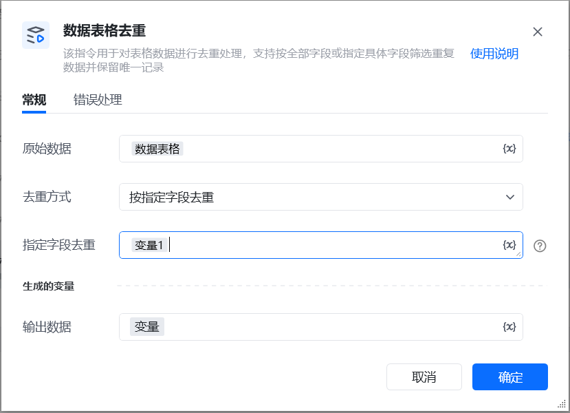
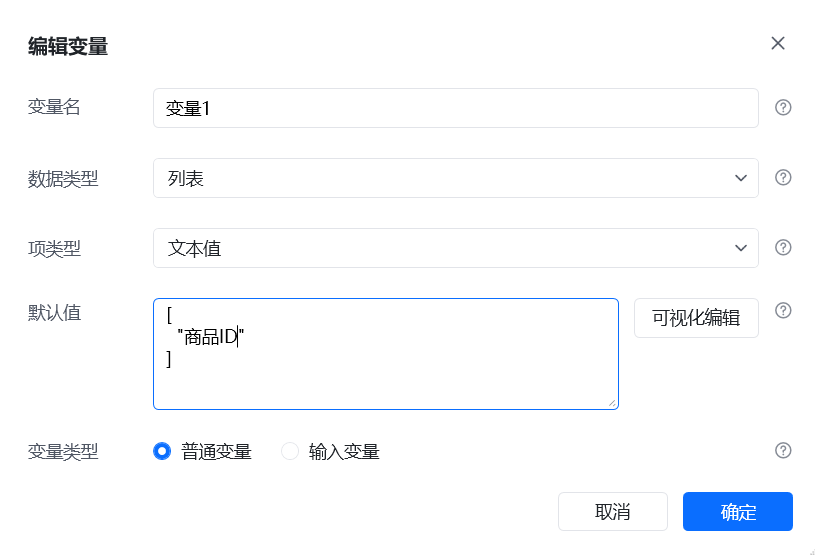
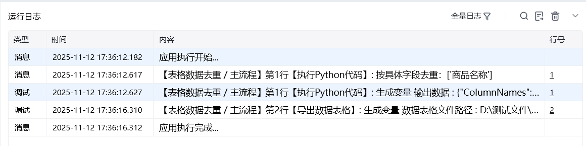

## 一、指令概述

该指令用于对表格数据进行去重处理，支持按全部字段或指定具体字段筛选重复数据并保留唯一记录，适用于数据清洗、数据分析前的预处理场景，确保数据的唯一性和准确性。

## 二、调用参数配置参数名称说明可选值 / 格式要求是否必填原始数据选择需要进行去重处理的原始表格数据已存在的表格数据变量是去重范围选择去重的方式按全部字段去重、按指定字段去重是去重字段选择按指定字段去重时，填写需要去重的文本值列表格式为文本值列表（例：“商品 ID, 店铺名称”）否（去重字段为 “按具体字段” 时必填）输出数据生成的去重后的数据变量自定义变量名称是
## 三、使用示例
### 示例场景

对包含 “商品 ID”“店铺名称”“销量” 字段的原始表格数据，按 “商品 ID” 字段进行去重，输出去重后的数据。
### 配置步骤

<strong>原始数据</strong>：选择待去重的原始表格数据变量（例：“原始商品数据”）。

<strong>去重方式</strong>：选择 “按具体字段”。

去重字段：这里填写的是一个文本值列表，列表里的每一项代表你所要去重的字段。如：需要要去建个文本值列表变量。然后填写所要去重的字段。

<strong>输出数据</strong>：定义变量名称（例：“去重后商品数据”）。

点击 “确定” 执行指令。
## 四、运行效果

执行指令后，RPA 会按照配置的去重字段对原始表格数据进行去重处理，生成仅包含唯一记录的新表格数据。可通过 “输出数据” 变量调用去重后的数据，用于后续分析或存储。

五、注意事项确保 “原始数据” 为有效的表格数据变量，避免因数据格式错误导致去重失败。选择 “按具体字段” 去重时，“具体字段” 需准确填写文本值列表，字段名称需与原始数据中的字段完全一致。若选择 “按全部字段” 去重，需确保原始数据中存在多条完全重复的记录，否则去重后数据无变化。重复判断：通过唯一标识记录已出现的行，首次出现的行保留，后续出现相同唯一标识的行直接剔除。
六、延伸应用数据清洗流程中，对多来源整合的表格数据进行去重，保证分析数据的纯净性。结合电商订单数据，按 “订单 ID” 字段去重，筛选唯一订单记录。对用户信息表按 “用户 ID” 去重，构建唯一用户库，支撑用户运营分析。

<Info>
  使用指令过程中遇到问题？前往 [八爪鱼RPA 开发者社区问答板块](https://rpa.bazhuayu.com/community/questions) 提问，获取官方与社区帮助。
</Info>
