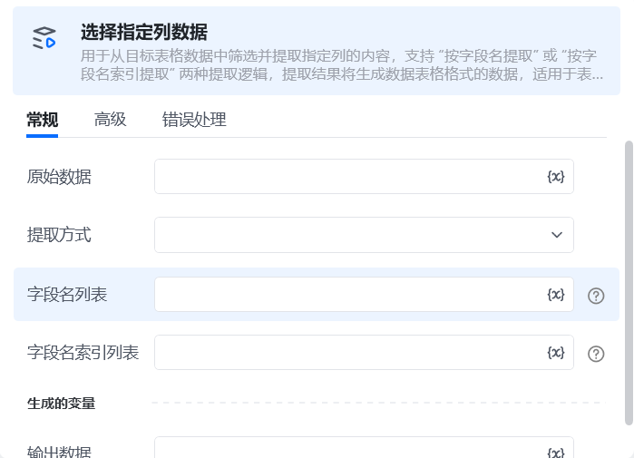
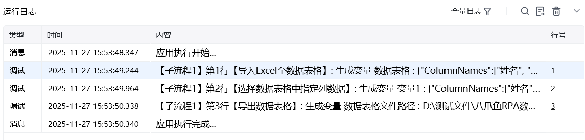

## 一、指令概述

用于从目标表格数据中筛选并提取指定列的内容，支持  “按字段名提取” 或 “按字段名索引提取” 两种提取逻辑，提取结果将生成数据表格格式的数据，适用于表格数据的精准列筛选场景。

## 二、调用参数配置参数名称描述配置规则备注原始数据选择待提取数据的表格来源输入 / 选择已定义的表格数据对象（如 “商品信息表”）<strong>必填</strong>（非选填）提取方式选择数据提取的依据下拉选项：- 按指定字段提取- 按列索引提取必填字段名列表当 “提取方式” 为 “按字段名提取” 时，填写待提取的字段名称（多个用逗号分隔）输入格式为文本值列表（如[ “商品名称，库存数量”]）选填（仅对应提取方式显示）字段名索引列表当 “提取方式” 为 “按字段名索引提取” 时，填写待提取的列序号（<strong>索引从 0 开始计数</strong>，如第 1 列填 0、第 2 列填 1）输入文本值列表（如 [“0,2”]）选填（仅对应提取方式显示）输出数据展示处理后的数据，数据格式为数据表格格式只读
## 三、使用示例
### 示例 1：按字段名提取

以提取 “订单表” 中的 “订单编号” 和 “支付金额” 列为例：原始数据：选择 “订单表”；提取方式：选择 “按指定字段提取”；字段名列表：输入[“订单编号，支付金额”]；执行指令后，“订单核心数据” 变量将存储对应列的所有数据。
### 示例 2：按字段名索引提取

以提取 “商品信息表” 中第 1 列（索引 0）和第 3 列（索引 2）数据为例：原始数据：选择 “商品信息表”；提取方式：选择 “按列索引提取”；字段名索引列表：输入 [“0,2”]（注：索引从 0 开始，对应表格第 1 列、第 3 列）；执行指令后，变量将存储对应索引列的所有数据。
## 四、运行效果

根据配置的 “提取方式” 与目标列规则，从原始表格中筛选出对应列的数据，以数据表格的形式存入指定变量，后续流程可直接调用该变量进行数据处理。

五、注意事项“原始数据” 为必填项，需提前确保表格数据已正确加载；“指定字段列表” 需与表格实际字段名完全一致（区分大小写），否则会提取失败；重点提醒：“列索引列表”<strong>索引从 0 开始计数</strong>（第 1 列对应索引 0、第 2 列对应索引 1，以此类推），需严格按照该规则填写，避免索引错误；若提取的列数据为空，变量会返回空列表，建议提前校验原始表格的有效性；多个字段 / 索引之间需用英文逗号分隔，不可添加空格。

<Info>
  使用指令过程中遇到问题？前往 [八爪鱼RPA 开发者社区问答板块](https://rpa.bazhuayu.com/community/questions) 提问，获取官方与社区帮助。
</Info>
