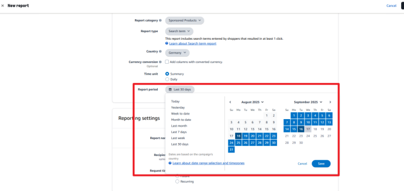
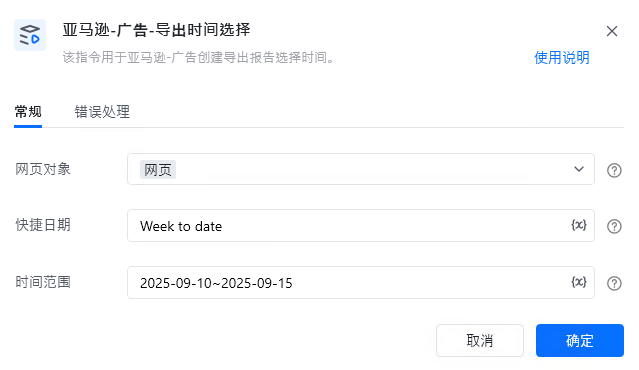

# 一.功能描述

该指令用于亚马逊-广告创建导出报告选择时间。

# 二.使用参数说明
## 1.输入参数

<strong>网页对象：</strong>

传入已打开的网页对象。

<strong>快捷日期：</strong>

输入快捷日，例如：Today，Yesterday。

若填写【日期范围】则该项不填。

<strong>日期范围：</strong>

填写日期范围，例如：2025-09-01~2025-09-15。

若填写【快捷日期】，可不填该项。
# 三.使用说明

<Info>
  使用指令过程中遇到问题？前往 [八爪鱼RPA 开发者社区问答板块](https://rpa.bazhuayu.com/community/questions) 提问，获取官方与社区帮助。
</Info>
