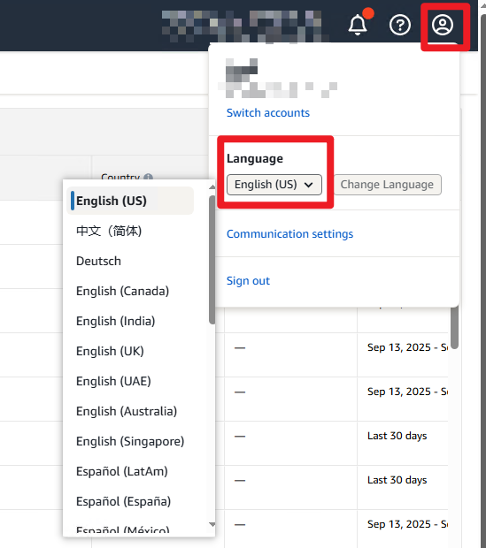
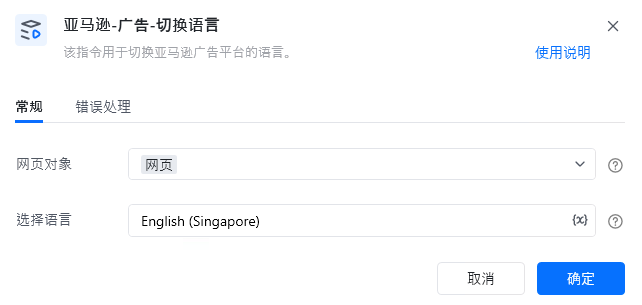

# 一.功能描述

该指令用于切换亚马逊广告平台的语言。

# 二.使用参数说明
## 1.输入参数

<strong>网页对象：</strong>

传入已打开的网页对象。

<strong>选择语言：</strong>

请输入需要切换的语言，要和网页上显示的一致。

例如：English (US)、中文（简体)
# 三.使用说明

<Info>
  使用指令过程中遇到问题？前往 [八爪鱼RPA 开发者社区问答板块](https://rpa.bazhuayu.com/community/questions) 提问，获取官方与社区帮助。
</Info>
