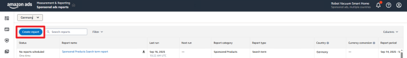
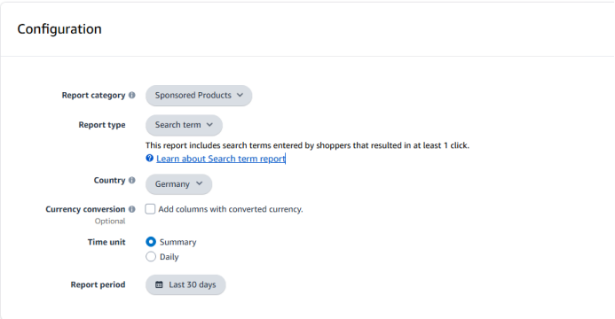
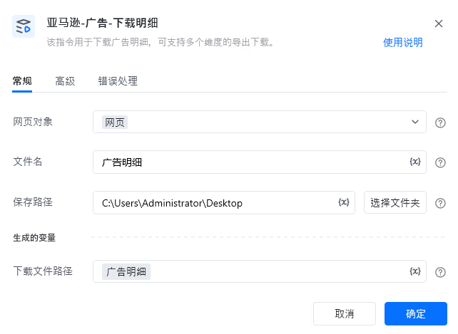
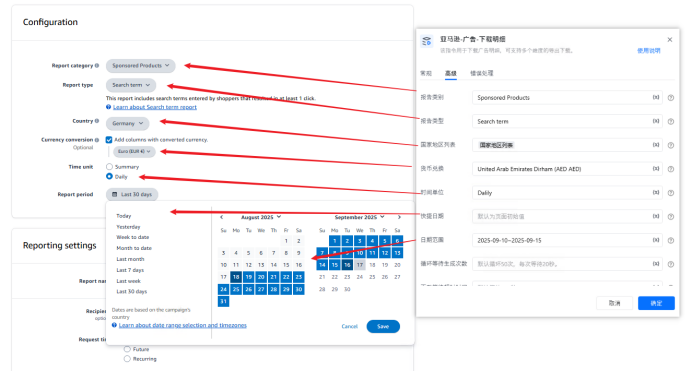
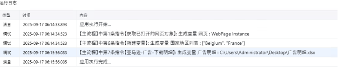

# 一.功能描述

该指令用于下载广告明细，可支持多个维度的导出下载。

# 二.使用参数说明
## 1.输入参数

<strong>网页对象：</strong>

传入已打开的网页对象。

<strong>文件名：</strong>

输入保存的文件名，无需填写后缀。

<strong>保存路径：</strong>

输入保存文件路径。
## 高级

<strong>报告类别：</strong>

输入报告类别，例如：Sponsored Products

<strong>报告类型：</strong>

输入报告类型，例如：Search term

<strong>国家地区列表：</strong>

传入地区列表，例如：['France','Italy']

<strong>货币兑换：</strong>

输入货币兑换值，例如：United Arab Emirates Dirham (AED AED)

<strong>时间单位：</strong>

输入时间单位，例如：Summary，Daily

<strong>快捷日期：</strong>

输入快捷日，例如：Today，Yesterday。

若填写【日期范围】则该项不填。

<strong>日期范围：</strong>

填写日期范围，例如：2025-09-01~2025-09-15。

若填写【快捷日期】，可不填该项。

<strong>循环等待生成次数：</strong>

输入每次等待下载按钮的次数，每次等待20秒。

默认循环50次，每次等待20秒。

<strong>下载等待超时时间：</strong>

输入下载等待超时时间，默认300秒。

默认等待300秒
## 2.输出参数

<strong>下载文件路径：</strong>

输出下载文件路径。
# 三.使用说明

<Info>
  使用指令过程中遇到问题？前往 [八爪鱼RPA 开发者社区问答板块](https://rpa.bazhuayu.com/community/questions) 提问，获取官方与社区帮助。
</Info>
