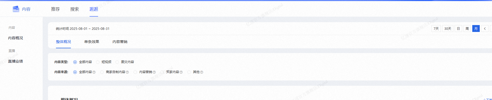
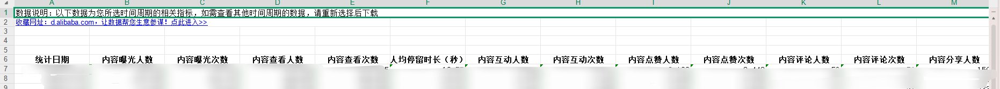
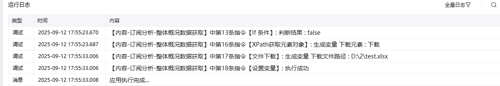

# <strong>生意参谋-内容-</strong>逛逛分析<strong>-</strong>整体概况<strong>数据-下载明细</strong>
# <strong>一.功能描述</strong>

用于 生意参谋-内容-逛逛分析-整体概况数据的获取

# <strong>二.使用参数说明</strong>
## <strong>1.输入参数</strong>

<strong>网页对象：</strong> 传入已打开的网页对象。

<strong>适用的浏览器类型:</strong> Google Chrome浏览器

<strong>日期类型：</strong> 下拉选择日期控件类型 支持：7天，30天，日，周，月

<strong>日期：</strong> 若选择日、周请补充一个具体日期，格式：yyyy-mm-dd；如2025-01-01 若选择月请选择到月，格式：yyyy-mm；如2025-08

<strong>内容类型：根据页面上选择</strong>

<strong>内容来源：根据页面上选择</strong>

<strong>保存文件名：</strong>

输入保存文件的文件名。

<strong>保存文件夹：</strong>

输入保存文件的文件夹路径。

### <strong>高级</strong>
## <strong>无</strong>
## <strong>2.输出参数</strong>

<strong>下载文件路径：</strong>

输出下载后的文件绝对路径。
# <strong>三.结果样例展示</strong>

## <strong>运行结果：</strong>

<Info>
  使用指令过程中遇到问题？前往 [八爪鱼RPA 开发者社区问答板块](https://rpa.bazhuayu.com/community/questions) 提问，获取官方与社区帮助。
</Info>
