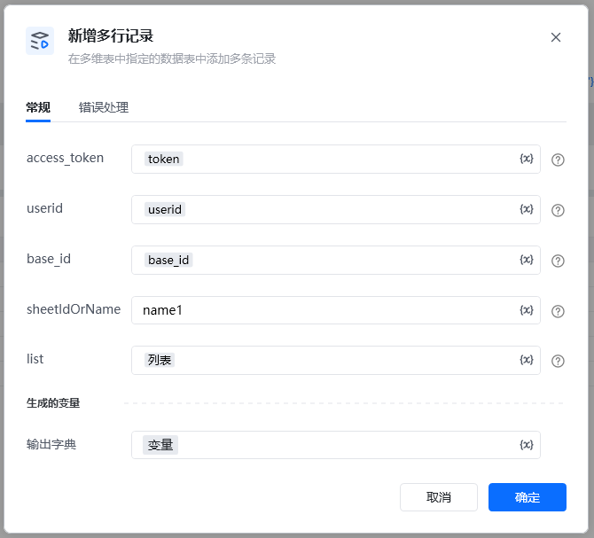
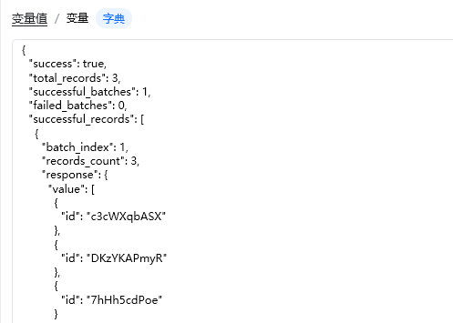

## 输入

access_token: 可通过【获取access_token】指令获取

userid: 用户id，在钉钉后台管理——成员管理中获取到用户的UserID，可参考指令【创建数据表】指令使用说明有图文教程

base_id: 表格id，可以从文档信息里面获取，点击文档右上角的三个小点，选择文档信息，其中文档ID就是多维表id，可以通过查看【创建数据表】指令使用说明有图文教程

sheetIdOrName: 名称可以直接在表里面查看，数据表ID可以通过调用【获取所有数据表】接口获取ID

list：数据类型任意值列表

List 任意值列表  标题对应表格里的标题名称

\{"标题":"文本11"\}

\{"标题":"文本22"\}

\{"标题":"文本33"\}

附件格式\{"附件":[\{  "filename": "6.xlsx",  "size": 37040,  "type": "application/vnd.openxmlformats-officedocument.spreadsheetml.sheet",  "url": "/core/api/resources/78f072b9-a3d6-43f8-bc93-9d4812bd70d9/detail",  "resourceId": "78f072b9-a3d6-43f8-bc93-9d4812bd70d9"\}]\}

<Info>
  使用指令过程中遇到问题？前往 [八爪鱼RPA 开发者社区问答板块](https://rpa.bazhuayu.com/community/questions) 提问，获取官方与社区帮助。
</Info>
