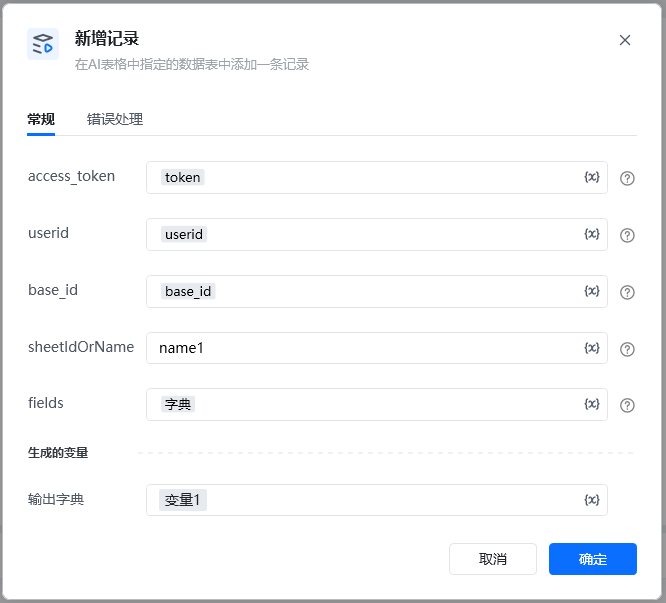
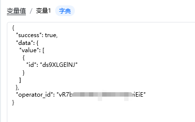

## 输入

access_token: 可通过【获取access_token】指令获取

userid: 用户id，在钉钉后台管理——成员管理中获取到用户的UserID，可参考指令【创建数据表】指令使用说明有图文教程

base_id: 表格id，可以从文档信息里面获取，点击文档右上角的三个小点，选择文档信息，其中文档ID就是多维表id，可以通过查看【创建数据表】指令使用说明有图文教程

sheetIdOrName: 名称可以直接在表里面查看，数据表ID可以通过调用【获取所有数据表】接口获取ID

fields  字典类型  字段名称和字段的值\{ "标题": "文本917"\}

上传附件格式，相关参数可通过指令【上传附件】获取\{
"附件": [
\{
"filename": "03ae2f12a94d921cfd815d40e0d6eb35.jpg",
"size": 1746551,
"type": "image/jpeg",
"url": "/core/api/resources/img/5eecdaf48460cde5ba8cb809e943b42c21a24c9d68cb29cf75b8339e1c4c2483890798d4445e2737115b5d1153adab25a156a98577f418d5e2dead01fbda3468d71c9e22aeacb0625c026064cc849490fc5fe7890895f851eca2a208135a38f1",
"resourceId": "d7d52fc0-bca6-4d14-abff-c529d982066b"
\}
]
\}

<Info>
  使用指令过程中遇到问题？前往 [八爪鱼RPA 开发者社区问答板块](https://rpa.bazhuayu.com/community/questions) 提问，获取官方与社区帮助。
</Info>
