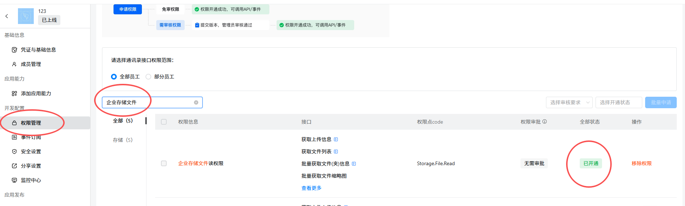
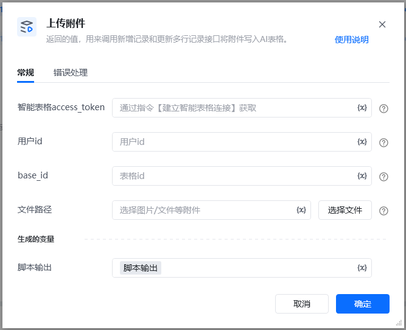
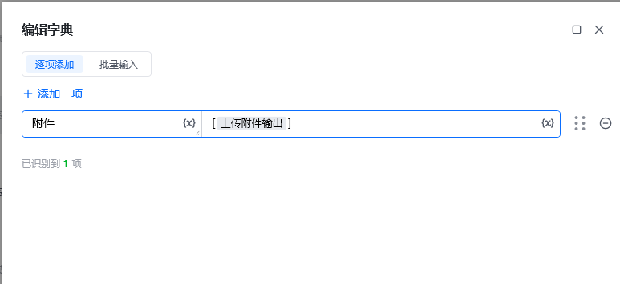

应用需要开通的API权限，企业存储文件读权限，才可以调用该API

## 输入

access_token: 可通过【获取access_token】指令获取

userid: 用户id，在钉钉后台管理——成员管理中获取到用户的UserID，可参考指令【创建数据表】指令使用说明有图文教程

base_id: 表格id，可以从文档信息里面获取，点击文档右上角的三个小点，选择文档信息，其中文档ID就是多维表id，可以通过查看【创建数据表】指令使用说明有图文教程

返回示例

\{

"filename": "03ae2f12a94d921cfd815d40e0d6eb35.jpg",

"size": 1746551,

"type": "image/jpeg",

"url": "/core/api/resources/img/5eecdaf48460cde5ba8cb809e943b42c21a24c9d68cb29cf75b8339e1c4c2483890798d4445e2737115b5d1153adab25a156a98577f418d563accffca2fad2863555644fa7cc261b4b68dc21f181fcbf238c5a47d68d13e2fc42f90ecce6f169",

"resourceId": "a74b2e31-6f1a-49a2-a864-05ba1d8802fe"

\}

调用【新增记录】和【更新多行记录】接口将附件写入AI表格。

新建记录，附件修改为实际表格名称

更新多行记录，任意值列表，id修改为某条数据的RECORD_ID

官网文档[官网文档](https://open.dingtalk.com/document/development/upload-attachment)

<Info>
  使用指令过程中遇到问题？前往 [八爪鱼RPA 开发者社区问答板块](https://rpa.bazhuayu.com/community/questions) 提问，获取官方与社区帮助。
</Info>
