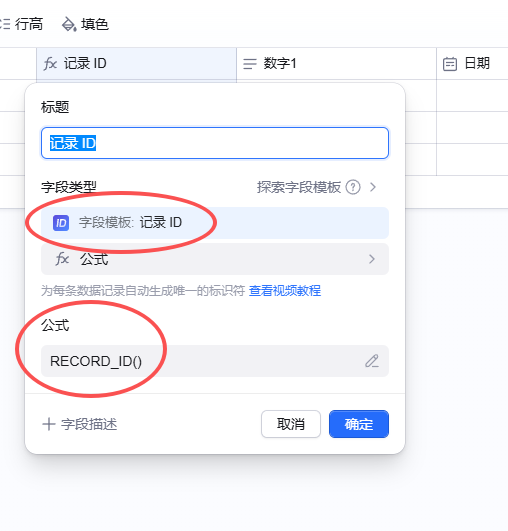
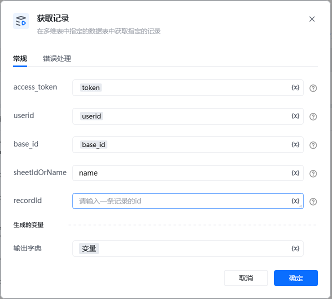
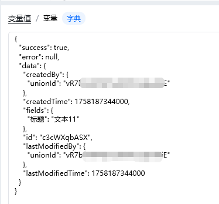

## 输入

access_token: 可通过【获取access_token】指令获取

userid: 用户id，在钉钉后台管理——成员管理中获取到用户的UserID，可参考指令【创建数据表】指令使用说明有图文教程

base_id: 表格id，可以从文档信息里面获取，点击文档右上角的三个小点，选择文档信息，其中文档ID就是多维表id

sheetIdOrName: 名称可以直接在表里面查看，数据表ID可以通过调用【获取所有数据表】接口获取ID

<strong>recordId </strong>  记录ID，表格里面，可以使用公式RECORD_ID()  来获取id值

<Info>
  使用指令过程中遇到问题？前往 [八爪鱼RPA 开发者社区问答板块](https://rpa.bazhuayu.com/community/questions) 提问，获取官方与社区帮助。
</Info>
