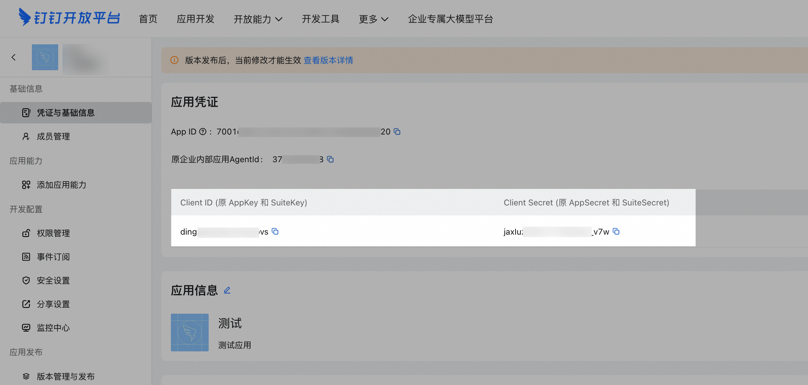

企业内部应用调用本接口获取accessToken。调用服务端API获取应用资源时，需要通过accessToken来鉴权调用者身份进行授权。

<strong>说明</strong>

在使用accessToken时，请注意：accessToken的有效期为7200秒（2小时），有效期内重复获取会返回相同结果并自动续期，过期后获取会返回新的accessToken。开发者需要缓存accessToken，用于后续接口的调用。因为每个应用的accessToken是彼此独立的，所以进行缓存时需要区分应用来进行存储。不能频繁调用gettoken接口，否则会受到频率拦截。

在获取accessToken前，需要在开发者后台查看应用的 Cilent ID（原企业内部应用AppKey）和 Cilent Secret（原企业内部应用AppSecret）：登录钉钉开发者后台[钉钉开发者后台](https://open-dev.dingtalk.com/)。在应用开发页面，单击目标应用进入应用详情页面。（没有应用，创建1个应用）在凭证与基础信息页面，复制应用的 Cilent ID（原企业内部应用AppKey）和Cilent Secret（原企业内部应用AppSecret）。

## ## 错误码

HttpCode错误码错误信息说明400invalidClientIdOrSecret无效的clientId或者clientSecret无效的clientId或者clientSecret

<Info>
  使用指令过程中遇到问题？前往 [八爪鱼RPA 开发者社区问答板块](https://rpa.bazhuayu.com/community/questions) 提问，获取官方与社区帮助。
</Info>
