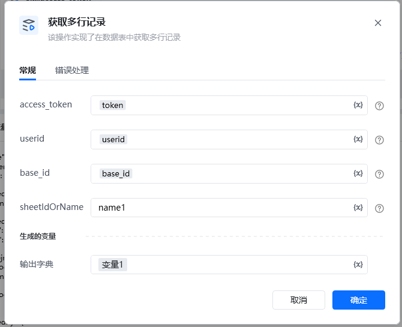
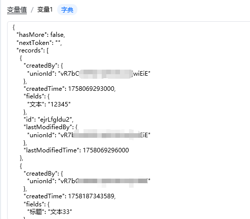

## 输入

<strong>access_token: </strong>可通过【获取access_token】指令获取

<strong>userid: </strong> 获取方法  创建数据表 使用说明

<strong>base_id: </strong>获取方法 创建数据表 使用说明

<strong>sheetIdOrName: </strong>名称可以直接在表里面查看，数据表ID可以通过调用【获取所有数据表】接口获取ID。

<Info>
  使用指令过程中遇到问题？前往 [八爪鱼RPA 开发者社区问答板块](https://rpa.bazhuayu.com/community/questions) 提问，获取官方与社区帮助。
</Info>
