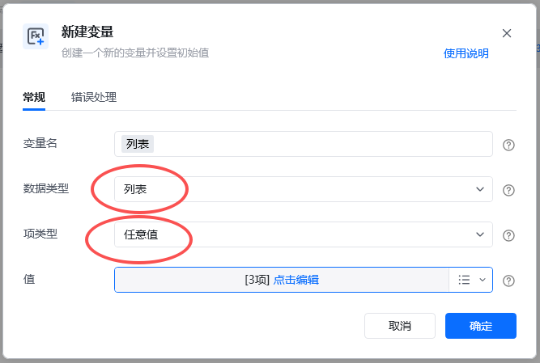
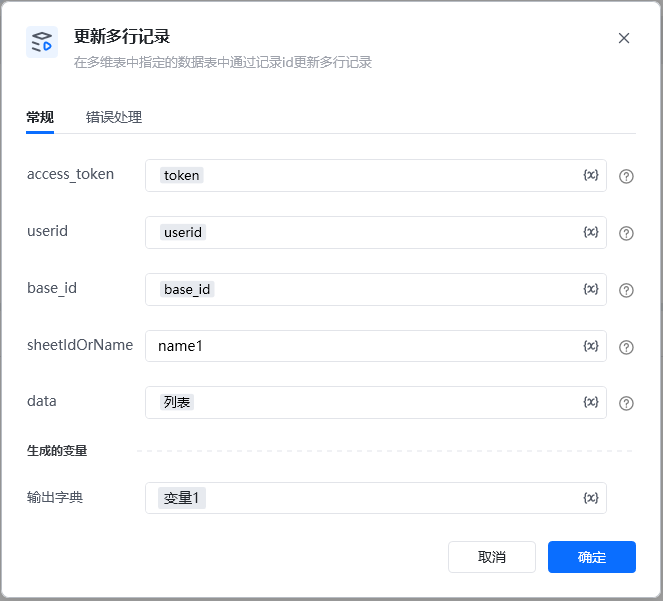
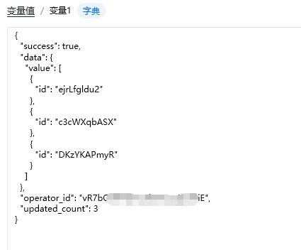

## 输入

<strong>access_token: </strong>可通过【获取access_token】指令获取

<strong>userid: </strong>  用户id，在钉钉后台管理——成员管理中获取到用户的UserID，可参考指令【创建数据表】指令使用说明有图文教程

<strong>base_id: </strong>表格id，可以从文档信息里面获取，点击文档右上角的三个小点，选择文档信息，其中文档ID就是多维表id，可以通过查看【创建数据表】指令使用说明有图文教程

<strong>sheetIdOrName: </strong>名称可以直接在表里面查看，数据表ID可以通过调用【获取所有数据表】接口获取ID。

data：要更新的记录列表，每个记录包含id和fields，参考下面格式

上传附件格式，相关参数可通过指令【上传附件】获取[
\{
"id": "0TlUhPMr7S",
"fields": \{
"标题": "测试成功1",
"标题1": "18点666",
"数字1": 661
\}
\},
\{
"id": "0zPjvG2rib",
"fields": \{
"标题1": "文111667",
"日期": 1688601600000
\}
\},
\{
"id": "1xGTG3gyES",
"fields": \{
"标题1": "文555667",
"数字1": 555
\}
\},
\{
"id": "8PAr8pmxff",
"fields": \{
"附件": [\{
"fileName": "0.jpg",
"fileSize": 23948,
"fileType": "image/jpeg",
"fileUrl": "/core/api/resources/img/5eecdaf48460cde5ba8cb809e943b42c21a24c9d68cb29cf75b8339e1c4c2483890798d4445e2737115b5d1153adab25a156a98577f418d5df559c1a024eca85926cbaa05accd698997af93214f3bc25d6859c3c70fdccb4b203dbfc0dded587"
\}]
\}
\}

]
\}
]

<Info>
  使用指令过程中遇到问题？前往 [八爪鱼RPA 开发者社区问答板块](https://rpa.bazhuayu.com/community/questions) 提问，获取官方与社区帮助。
</Info>
