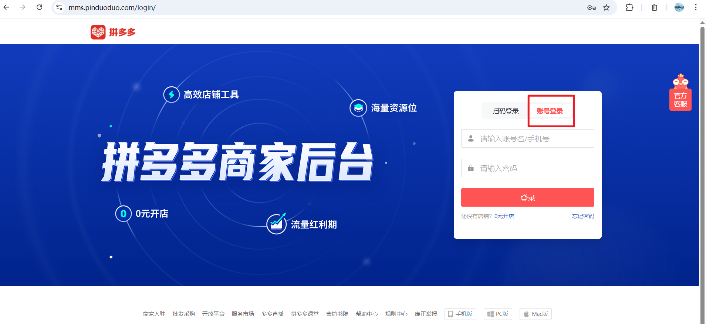
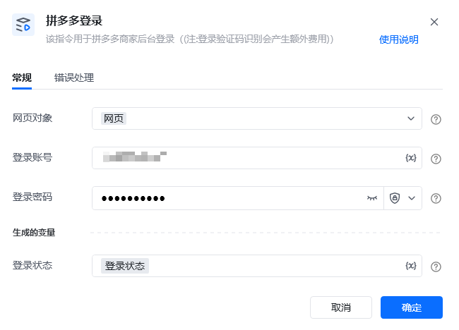
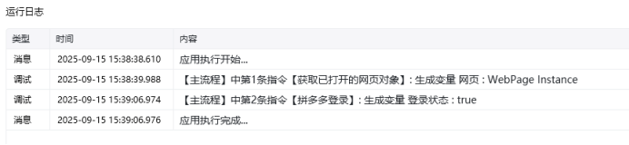

# 一.功能描述

用于拼多多商家后台登录(注:登录验证码识别会产生额外费用)。

https://mms.pinduoduo.com/login/[https://mms.pinduoduo.com/login/](https://mms.pinduoduo.com/login/)

# 二.使用参数说明
## 1.输入参数

<strong>登录网页</strong>

传入已打开的拼多多商家后台登录页面。

<strong>登录账号</strong>

请输入账号吗/手机号。

<strong>登录密码</strong>

请输入登录密码。
## 2.输出参数

<strong>登录状态</strong>

登录成功返回true，失败返回false。
# 三.结果样例展示及使用说明

## 运行结果：

<Info>
  使用指令过程中遇到问题？前往 [八爪鱼RPA 开发者社区问答板块](https://rpa.bazhuayu.com/community/questions) 提问，获取官方与社区帮助。
</Info>
