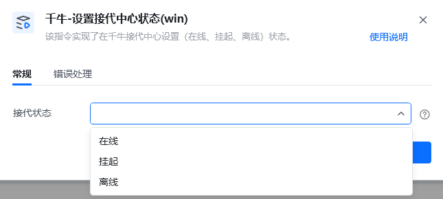
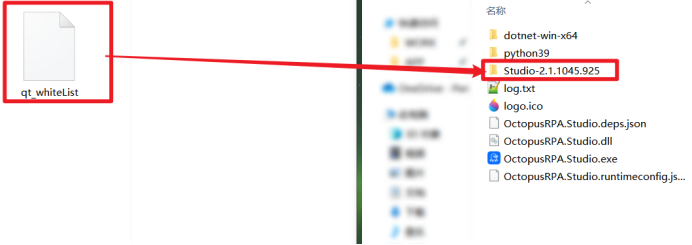
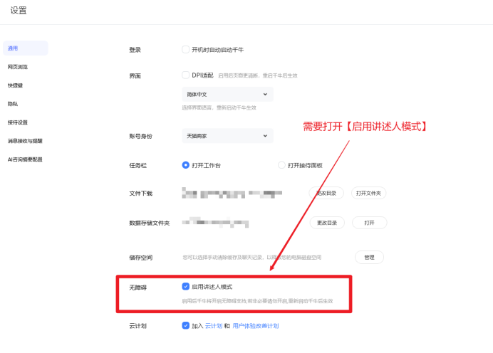

# 一.功能描述

该指令实现了在千牛接代中心设置（在线、挂起、离线）状态。

需要提前打开【接代中心】

# 二.使用参数说明
## 输入参数

<strong>接代状态：</strong>

选择接代状态。（在线、挂起、离线）
# 三.使用说明

# 四、注意事项

该指令运行前需要执行以下几个步骤

1、进入八爪鱼RPA安装目录下，移动qt_whiteList文件，移动后重启八爪鱼RPA

文件下载链接：https://skieer.feishu.cn/file/J6mubIui5ooTmaxHGVfc2OA4nib

2、适用于9.88.01N(1499,64)左右的版本，若发现不适配的情况，请重新安装千牛版本。

千牛设置需打开【启用讲述人模式】

<Info>
  使用指令过程中遇到问题？前往 [八爪鱼RPA 开发者社区问答板块](https://rpa.bazhuayu.com/community/questions) 提问，获取官方与社区帮助。
</Info>
