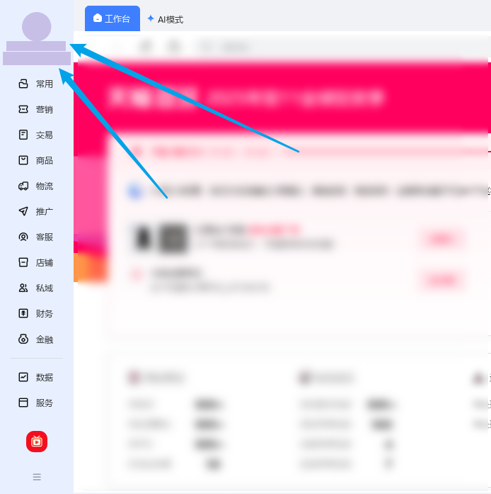

一.功能描述

该指令用于获取当前账号和店铺信息。

二.注意事项

该指令运行前需要执行以下几个步骤

1、进入八爪鱼RPA安装目录下，移动qt_whiteList文件，移动后重启八爪鱼RPA

文件下载链接：https://skieer.feishu.cn/file/J6mubIui5ooTmaxHGVfc2OA4nib

2、适用于9.88.01N(1499,64)左右的版本，若发现不适配的情况，请重新安装千牛版本。

千牛设置需打开【启用讲述人模式】

<Info>
  使用指令过程中遇到问题？前往 [八爪鱼RPA 开发者社区问答板块](https://rpa.bazhuayu.com/community/questions) 提问，获取官方与社区帮助。
</Info>
