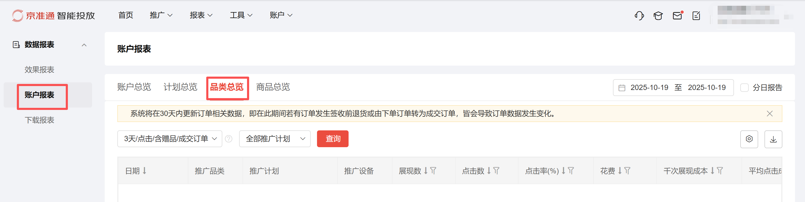
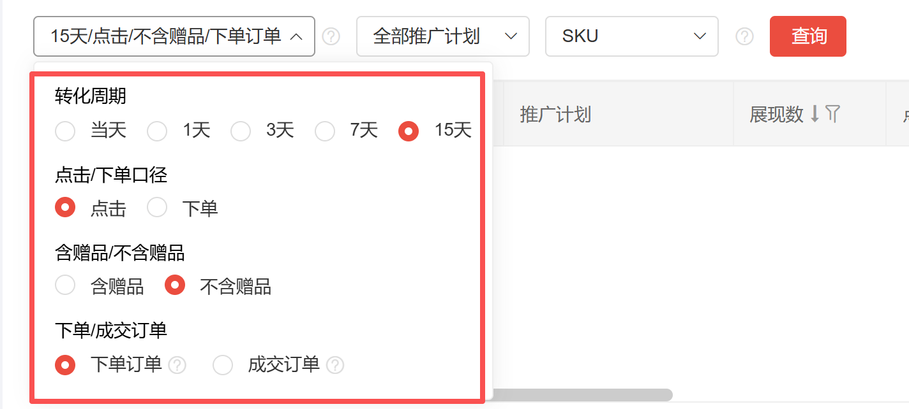
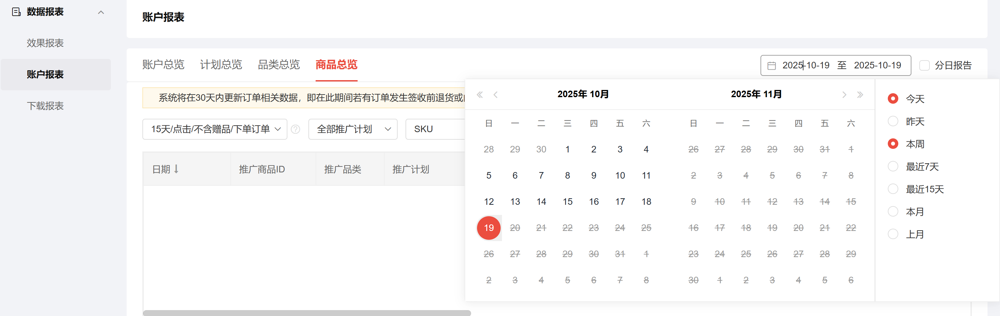
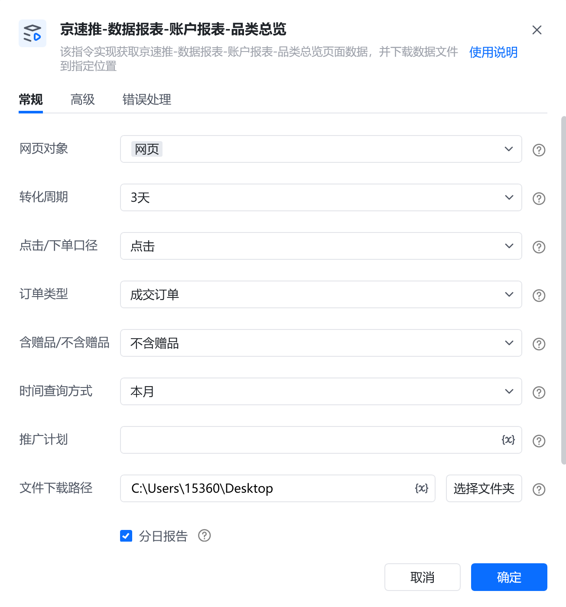
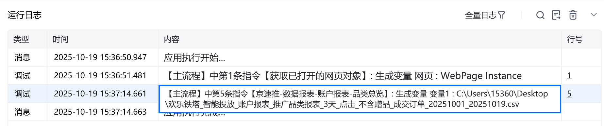

# 描述

该指令实现获取京速推-数据报表-账户报表-品类总览页面数据，并下载数据文件到指定位置

# 配置项说明
## 指令输入
#### 网页对象：

任意一个已登录京准通后台的网页对象
#### 转化周期：

下拉框，可选：当天、1天、3天、7天、15天，选填，若不填则默认15天

#### 点击/下单口径：

下拉框，可选：点击、下单，选填，不填则默认为点击

#### 含赠品/不含赠品：

下拉框，可选： 含赠品、不含赠品，选填，不填则默认为不含赠品

#### 订单类型：

下拉框，可选：下单订单、成交订单，选填，不填则默认为下单订单

#### 时间查询方式：

下拉框，可选择：今天、昨天、近7天、近15天、本周、本月、自定义(注意：由于平台限制，时间跨度不可超过90天)，选填，若不填则使用平台默认值

#### 自定义开始日期：

填写自定义开始日期，格式：YYYY-MM-DD，例如：2025-01-01，仅当时间查询方式为自定义时填写。由于平台限制，开始日期和结束日期跨度不可超过3个月
#### 自定义结束日期：

填写自定义结束日期，格式：YYYY-MM-DD，例如：2025-01-01，仅当时间查询方式为自定义时填写。由于平台限制，开始日期和结束日期跨度不可超过3个月
#### 推广计划：

填写推广计划，注意：填写内容需与平台选项保持一致（包含大小写字母、符号中英文状态、空格等，否则可能导致找不到选项）。选填，若不填则默认全部推广计划
#### 文件下载路径：

下载的文件保存的文件夹路径，支持本地文件夹预览和变量传参，必填项
#### 自定义文件名：

下载或生成文件保存的名称，选填，若不填则使用平台默认值
## 指令输出
#### 文件路径：

返回文本类型，完整的文件下载路径
# 使用示例

# 运行结果

<Info>
  使用指令过程中遇到问题？前往 [八爪鱼RPA 开发者社区问答板块](https://rpa.bazhuayu.com/community/questions) 提问，获取官方与社区帮助。
</Info>
