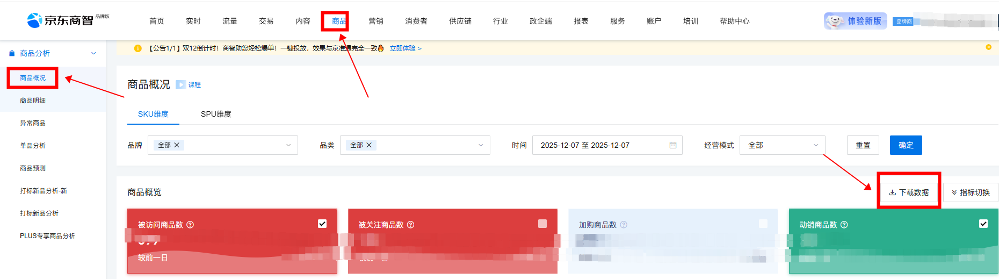
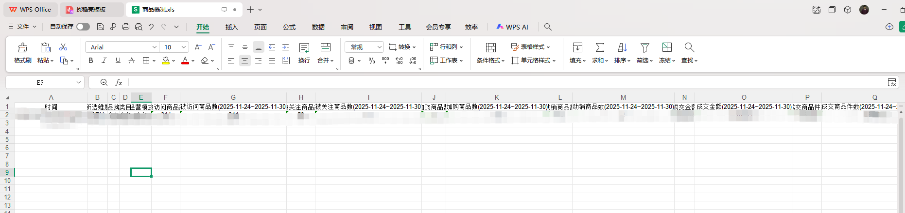

# 京东商智品牌版-商品-商品概况下载
# 描述

该指令实现了【京东商智品牌版】->【商品】->【商品概况】的数据获取，并将数据写入到Excel文件保存到指定路径下；

# 配置说明
适用的浏览器类型Google Chrome浏览器

## 输入

网页对象：已打开的浏览器对象

日期类型：可选择想要取数的维度日期或者快捷日期

自定义 /  昨天 /  近7天  / 近30天  /  按天 /  按周 /  按月

自定义：最多只能选择31天

经营模式：可选择需要的模式

全部   /  自营   /  合作

sku_spu维度：选择需要下载的维度

SKU维度 /  SPU维度

保存文件夹：请输入数据文件保存的文件夹路径

文件名称：自定义自己想要命名的文件名称

## 输出

输出文件路径：输出数据文件的路径

## 数据展示

<Info>
  使用指令过程中遇到问题？前往 [八爪鱼RPA 开发者社区问答板块](https://rpa.bazhuayu.com/community/questions) 提问，获取官方与社区帮助。
</Info>
