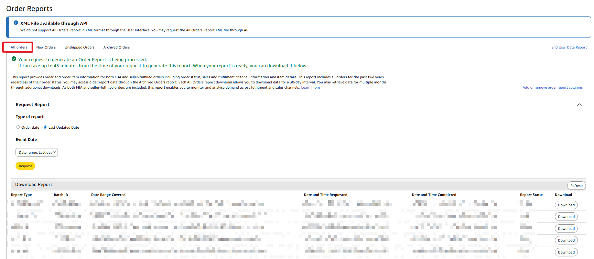
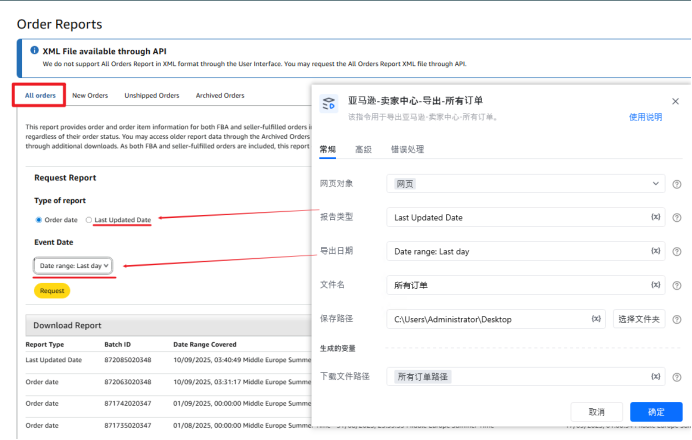

# 一.功能描述

该指令用于导出亚马逊-卖家中心-所有订单。

# 二.使用参数说明
## 1.输入参数

<strong>报告类型：</strong>请输入报告类型。例如：Order date、Last Updated Date

<strong>导出日期：</strong>

输入导出日期。例如：Date range: Last day

<strong>文件名：</strong>

输入保存的文件名，无需填写后缀。

<strong>保存路径：</strong>

输入保存文件路径。
## 高级

<strong>循环等待生成次数：</strong>

输入每次等待下载按钮的次数，每次等待20秒。

默认循环50次，每次等待20秒。

<strong>下载等待超时时间：</strong>

输入下载等待超时时间，默认300秒。

默认等待300秒
## 2.输出参数

<strong>下载文件路径：</strong>

输出下载文件路径。
# 三.使用说明

<Info>
  使用指令过程中遇到问题？前往 [八爪鱼RPA 开发者社区问答板块](https://rpa.bazhuayu.com/community/questions) 提问，获取官方与社区帮助。
</Info>
