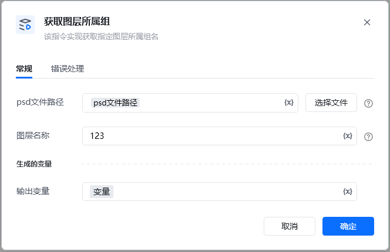
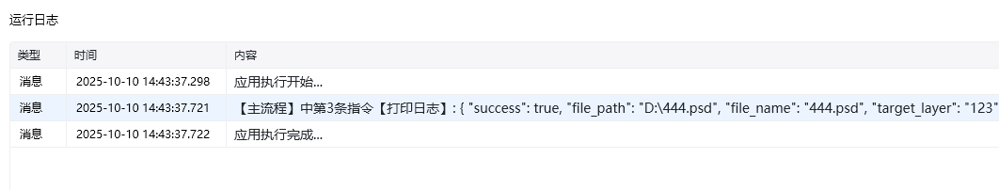

Photoshop 版本：Photoshop 版本支持2025✅2024✅2023✅2022✅2021✅2020✅CC2019✅CC2018✅CC2017✅
# # 获取图层所属组
## 描述

该指令获取 PS 图层所属组
## 参数配置
### 指令输入

Photoshop 文件路径

图层名: 字符串 ; 图层的名称, 找不到该图层会报错

### 指令输出 layer_group

输出字典类型

\{

"success": true,

"file_path": "D:\\444.psd",

"file_name": "444.psd",

"target_layer": "123",

"layer_found": true,

"layer_group": "组 1",

"all_groups": [

"组 1",

"组 2"

]
\}

<Info>
  使用指令过程中遇到问题？前往 [八爪鱼RPA 开发者社区问答板块](https://rpa.bazhuayu.com/community/questions) 提问，获取官方与社区帮助。
</Info>
