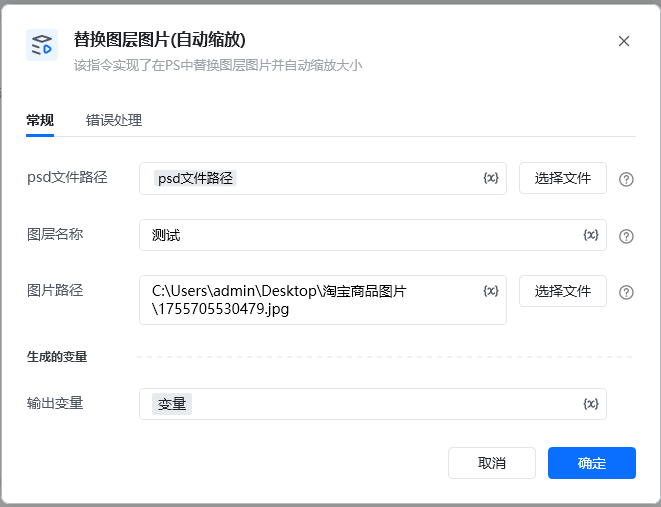
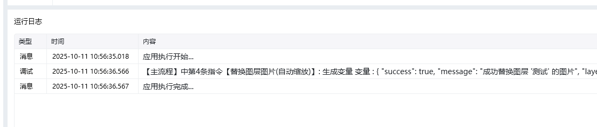

Photoshop 版本：Photoshop 版本支持2025✅2024✅2023✅2022✅2021✅2020✅CC2019✅CC2018✅CC2017✅
# # 替换图层图片(自动缩放)
## 描述

该指令将替换 PS 文档中的图片, 并自动缩放到原大小
## 配置
### 输入

<strong>PS 文件路径: </strong><em> </em>待操作的 PS 文件

<strong>名称: </strong><em>字符串, 待操作的图层名称</em>

<strong>图片路径: </strong><em>图片路径, </em>待保存图片的路径

输出

<Info>
  使用指令过程中遇到问题？前往 [八爪鱼RPA 开发者社区问答板块](https://rpa.bazhuayu.com/community/questions) 提问，获取官方与社区帮助。
</Info>
