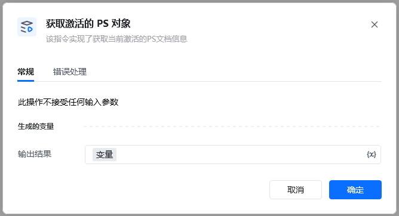
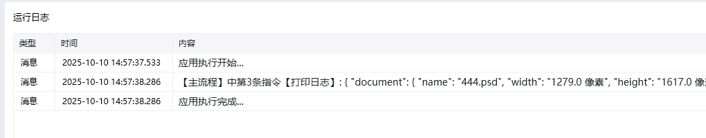

Photoshop 版本：Photoshop 版本支持2025✅2024✅2023✅2022✅2021✅2020✅CC2019✅CC2018✅CC2017✅
# # 获取激活的PS对象
## 描述

该指令实现获取当前激活的PS对象的功能
## 配置

### 输出

<em> </em>当前PS软件激活的文档字典类型

<Info>
  使用指令过程中遇到问题？前往 [八爪鱼RPA 开发者社区问答板块](https://rpa.bazhuayu.com/community/questions) 提问，获取官方与社区帮助。
</Info>
