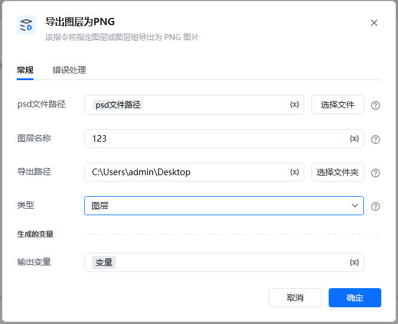
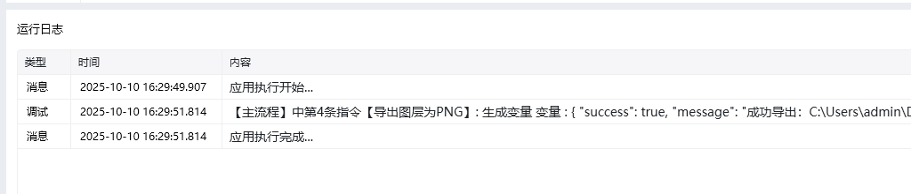

Photoshop 版本：Photoshop 版本支持2025✅2024✅2023✅2022✅2021✅2020✅CC2019✅CC2018✅CC2017✅
# # 导出图层为PNG
## 描述

该指令通过调用接口将PS指定图层导出为 PNG 图片
## 配置
### 输入
#### 常规

<strong>Photoshop 文件路径</strong>

<strong>图层名称: </strong><em>字符串, </em>待导出图层或组的名称

<strong>导出路径: </strong><em>字符串, </em>图片的保存路径,

<strong>类型: </strong><em>下拉选择, </em>导出图片的方式, 组名或者图层

## 输出

<Info>
  使用指令过程中遇到问题？前往 [八爪鱼RPA 开发者社区问答板块](https://rpa.bazhuayu.com/community/questions) 提问，获取官方与社区帮助。
</Info>
