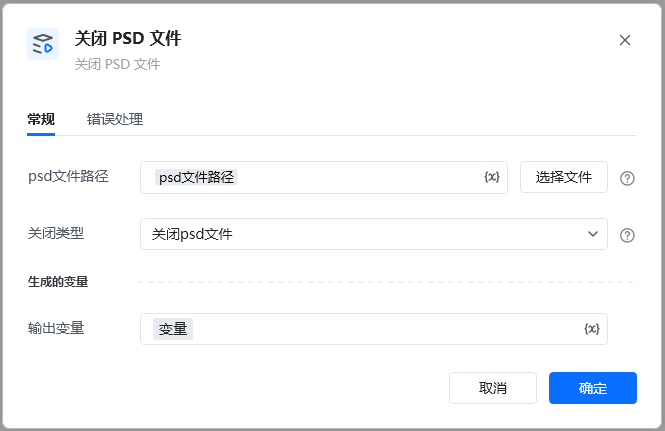
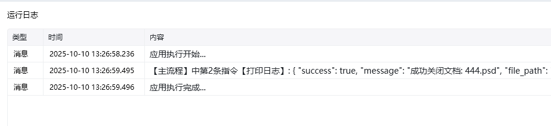
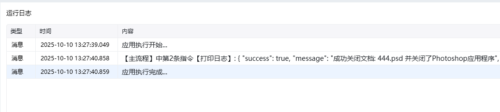

Photoshop 版本：Photoshop 版本支持2025✅2024✅2023✅2022✅2021✅2020✅CC2019✅CC2018✅CC2017✅
#### # 关闭 PSD 文件
### 描述

关闭打开的 PSD 文件。
### 配置项说明
#### 输入

photoshop 文件路径。

关闭类型： 只关闭psd文件，关闭文件和ps软件。

#### 输出

<Info>
  使用指令过程中遇到问题？前往 [八爪鱼RPA 开发者社区问答板块](https://rpa.bazhuayu.com/community/questions) 提问，获取官方与社区帮助。
</Info>
