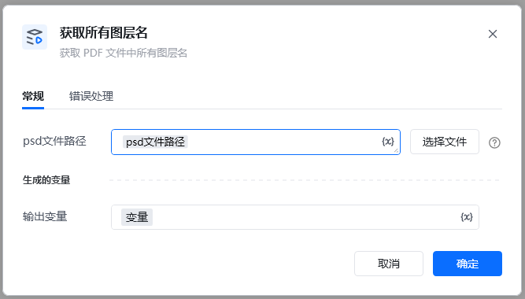
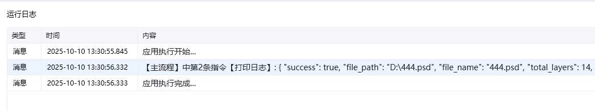

Photoshop 版本：Photoshop 版本支持2025✅2024✅2023✅2022✅2021✅2020✅CC2019✅CC2018✅CC2017✅
# # 获取所有图层名
### 描述

获取 Photoshop 文件的所有图层名字。
### 配置项说明
#### 输入

Photoshop 文件路径

#### 输出

所有图层名： 所有图层的名字，输出为字典类型

\{

"success": true,

"file_path": "D:\\444.psd",

"file_name": "444.psd",

"total_layers": 14,

"layer_names": [

"图层 3",

"111",

"图层 2",

"图层 1",

"name1"

]

\}

<Info>
  使用指令过程中遇到问题？前往 [八爪鱼RPA 开发者社区问答板块](https://rpa.bazhuayu.com/community/questions) 提问，获取官方与社区帮助。
</Info>
