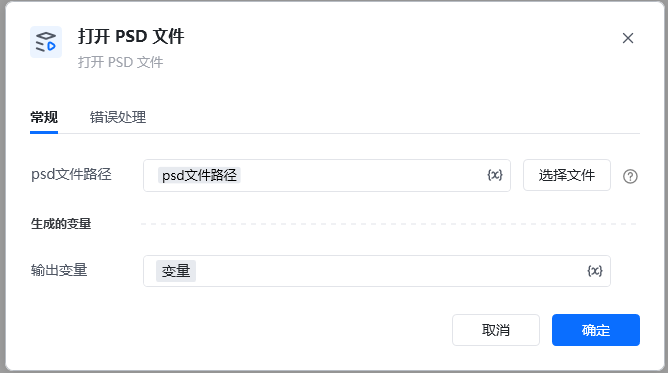
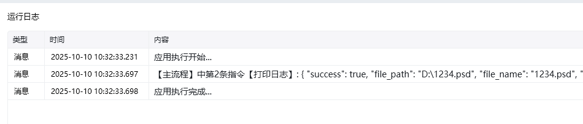

Photoshop 版本：Photoshop 版本支持2025✅2024✅2023✅2022✅2021✅2020✅CC2019✅CC2018✅CC2017✅
# 打开 PSD 文件
### 描述

用 Photoshop 打开一个 .psd 文件。
### 配置项说明
#### 输入

PSD 文件路径： PSD 文件所在的路径。

#### 输出

psd文件详细字典信息

### 使用示例

<Info>
  使用指令过程中遇到问题？前往 [八爪鱼RPA 开发者社区问答板块](https://rpa.bazhuayu.com/community/questions) 提问，获取官方与社区帮助。
</Info>
