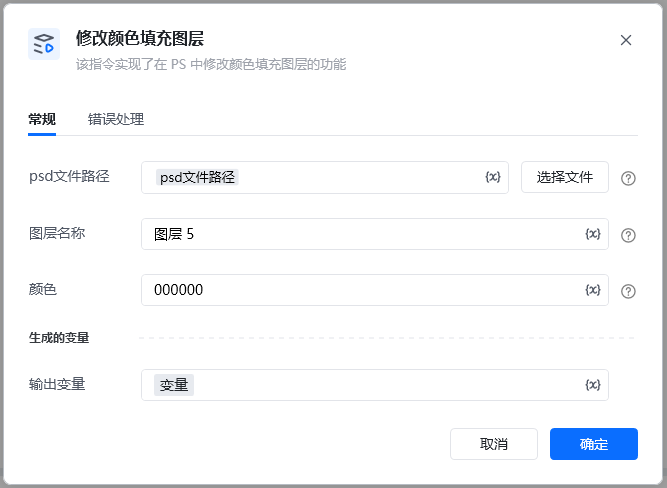
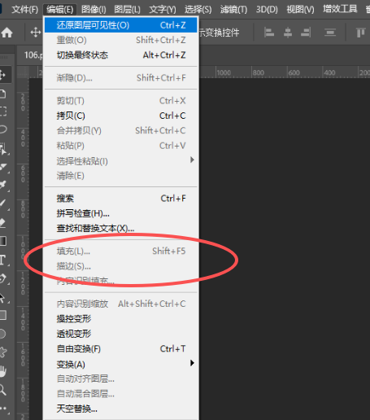
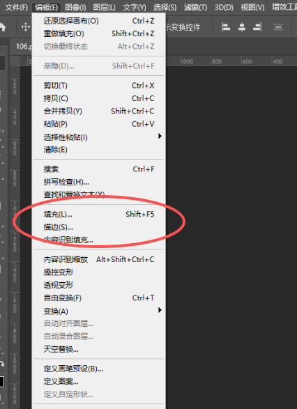

Photoshop 版本：Photoshop 版本支持2025✅2024✅2023✅2022✅2021✅2020✅CC2019✅CC2018✅CC2017✅
# # 修改颜色填充图层
## 描述

该指令通过调用接口对 PS 文件的指定图层进行颜色填充
## 配置
### 输入
#### 常规

<strong>Photoshop 文件路径</strong>

<strong>图层名: </strong><em>字符串, </em>待操作图层的名称

<strong>颜色RGB值: </strong><em>字符串, </em>RGB颜色的HEX值, 如, #FFEEFF, FFEEFF

注意事项

部分图层 选择图层 编辑查看 填充功能灰色不可用，过程中会报错

可以正常被操作的图层，会显示黑色

<Info>
  使用指令过程中遇到问题？前往 [八爪鱼RPA 开发者社区问答板块](https://rpa.bazhuayu.com/community/questions) 提问，获取官方与社区帮助。
</Info>
