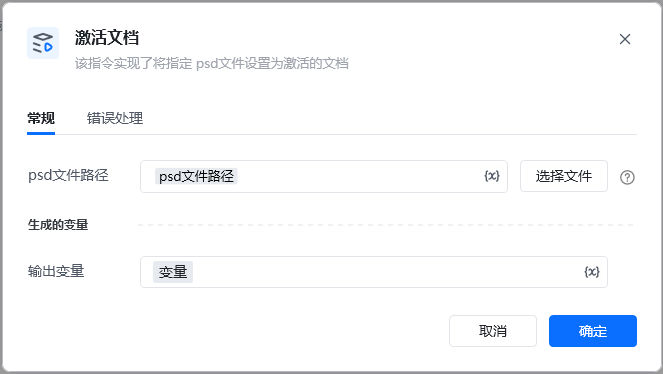
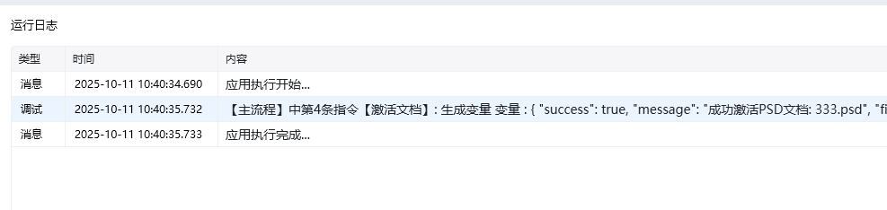

Photoshop 版本：Photoshop 版本支持2025✅2024✅2023✅2022✅2021✅2020✅CC2019✅CC2018✅CC2017✅
# # 激活文档
## 描述

该指令实现了将指定的 spd文件 设置为当前激活的文档
## 配置
### 输入

psd文件路径，在多个打开的 ps 文档中进行切换

输出

<Info>
  使用指令过程中遇到问题？前往 [八爪鱼RPA 开发者社区问答板块](https://rpa.bazhuayu.com/community/questions) 提问，获取官方与社区帮助。
</Info>
