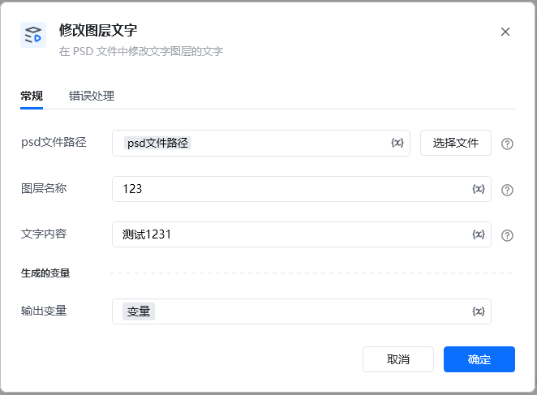
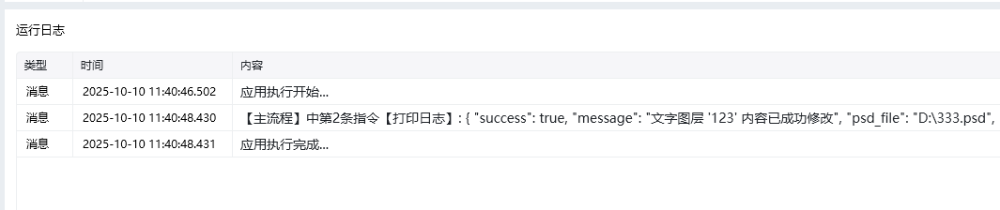

Photoshop 版本：Photoshop 版本支持2025✅2024✅2023✅2022✅2021✅2020✅CC2019✅CC2018✅CC2017✅
# # 修改图层文字
### 描述

根据图层名找到图层，修改这个文字类型的图层的文字内容。
### 配置项说明
#### 输入

psd文件路径：

图层名： 图层名。不是图层的文字内容。

文字内容： 新的文字内容，要替换上的文字内容。
#### 输出

<Info>
  使用指令过程中遇到问题？前往 [八爪鱼RPA 开发者社区问答板块](https://rpa.bazhuayu.com/community/questions) 提问，获取官方与社区帮助。
</Info>
