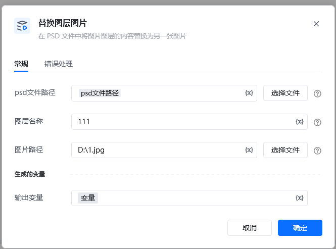
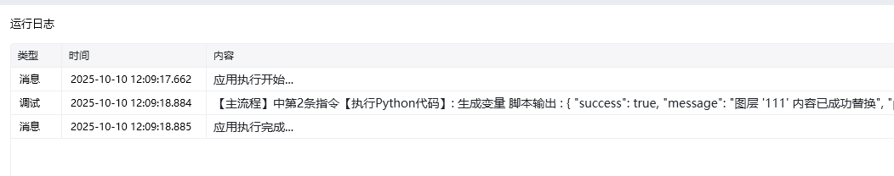

Photoshop 版本：Photoshop 版本支持2025✅2024✅2023✅2022✅2021✅2020✅CC2019✅CC2018✅CC2017✅
# # 替换图层图片
### 描述

在打开的 Photoshop 文件中按图层名找到图层，将这个图层的内容替换为指定的图片。
### 配置项说明
#### 输入

psd文件路径：

图层名： 图层名。不是图层的文字内容。

图片路径： 要替换为的图片文件路径，支持常见的图片格式。

#### 输出

<Info>
  使用指令过程中遇到问题？前往 [八爪鱼RPA 开发者社区问答板块](https://rpa.bazhuayu.com/community/questions) 提问，获取官方与社区帮助。
</Info>
