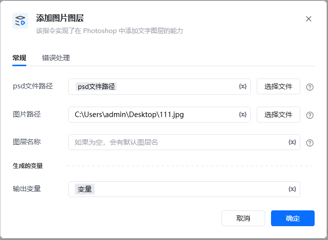
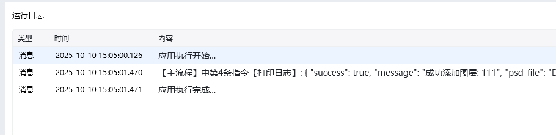

Photoshop 版本：Photoshop 版本支持2025✅2024✅2023✅2022✅2021✅2020✅CC2019✅CC2018✅CC2017✅
# # 添加图片图层
## 描述

该指令通过调用接口在 PS 添加新的图片图层
## 配置
### 输入
#### 常规

<strong>Photoshop 文件路径</strong>

<strong>图层名: </strong><em>字符串, </em>新建图层的名称, 为空将系统生成

<strong>图片路径: </strong><em>字符串, </em>用于创建图片图层的图片

输出

<Info>
  使用指令过程中遇到问题？前往 [八爪鱼RPA 开发者社区问答板块](https://rpa.bazhuayu.com/community/questions) 提问，获取官方与社区帮助。
</Info>
