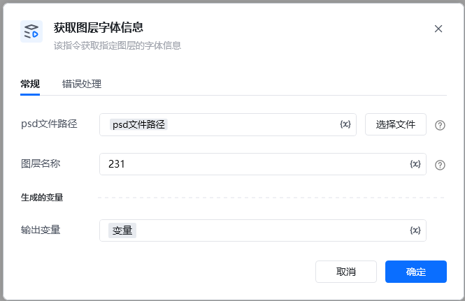
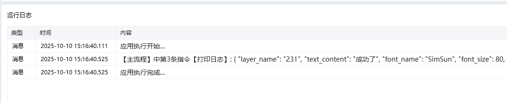

Photoshop 版本：Photoshop 版本支持2025✅2024✅2023✅2022✅2021✅2020✅CC2019✅CC2018✅CC2017✅
# # 获取图层文字信息
## 描述

该指令通过调用接口获取图层文字信息, 用于设置图层
## 配置
### 输入
#### 常规

<strong>Photoshop文件路径</strong>

<strong>图层名: </strong>图层的名称

### 输出字典类型

\{

"layer_name": "231",

"text_content": "成功了",

"font_name": "SimSun",

"font_size": 80,

"color": \{

"red": 0,

"green": 0,

"blue": 0

\},

"position": \{

"left": 437,

"top": 116,

"right": 664,

"bottom": 190

\},

"justification": "2",

"tracking": 0

\}

<Info>
  使用指令过程中遇到问题？前往 [八爪鱼RPA 开发者社区问答板块](https://rpa.bazhuayu.com/community/questions) 提问，获取官方与社区帮助。
</Info>
