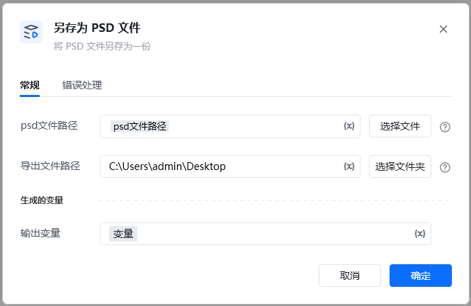
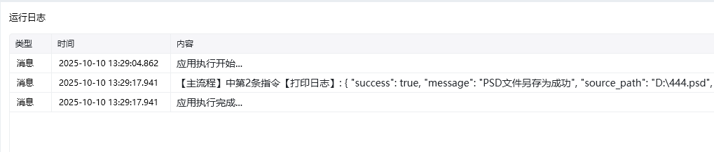

Photoshop 版本：Photoshop 版本支持2025✅2024✅2023✅2022✅2021✅2020✅CC2019✅CC2018✅CC2017✅
# # 另存为 PSD 文件
### 描述

把某个 PSD 文件另存为一份。
### 配置项说明
#### 输入

Photoshop 文件路径。

保存路径： 另存为的文件保存路径。

#### 输出

<Info>
  使用指令过程中遇到问题？前往 [八爪鱼RPA 开发者社区问答板块](https://rpa.bazhuayu.com/community/questions) 提问，获取官方与社区帮助。
</Info>
