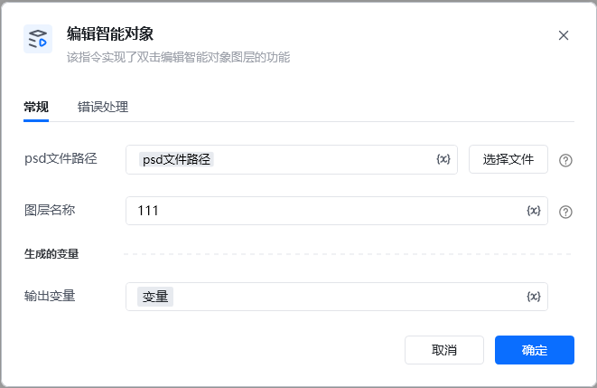
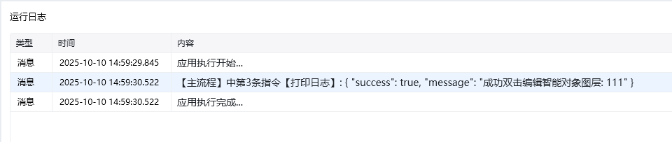

Photoshop 版本：Photoshop 版本支持2025✅2024✅2023✅2022✅2021✅2020✅CC2019✅CC2018✅CC2017✅
# # 编辑智能对象
## 描述

该指令实现了编辑智能对象, 跳转到智能对象编辑页面的功能
## 配置
### 输入

<strong>PS 文件路径: </strong><em> </em>待操作的 PS 文件

<strong>图层名称: </strong><em>字符串, 待操作的图层名称</em>

输出

<Info>
  使用指令过程中遇到问题？前往 [八爪鱼RPA 开发者社区问答板块](https://rpa.bazhuayu.com/community/questions) 提问，获取官方与社区帮助。
</Info>
