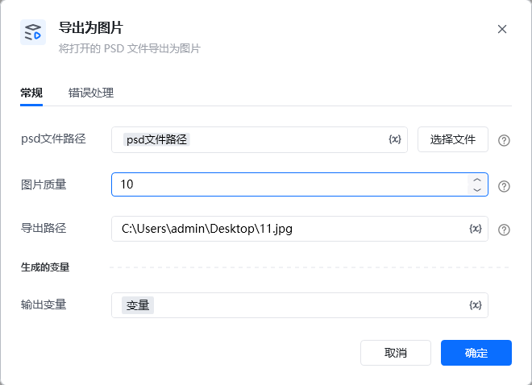
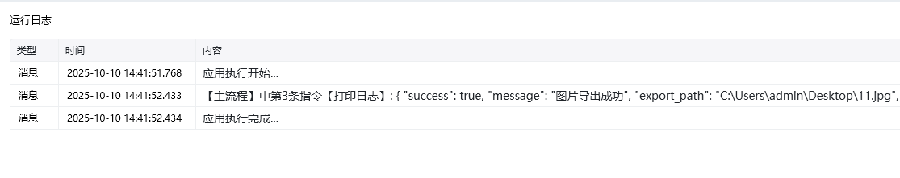

Photoshop 版本：Photoshop 版本支持2025✅2024✅2023✅2022✅2021✅2020✅CC2019✅CC2018✅CC2017✅
# # 导出为图片
### 描述

将 Photoshop 文件的内容保存为图片。
### 配置项说明
#### 输入

psd文件路径

导出质量： 导出图片的质量, 目前仅支持 jpg 格式的图片, 范围 1-12

保存路径： 要保存的图片路径，保存路径需以 png、jpg结尾

#### 输出

<Info>
  使用指令过程中遇到问题？前往 [八爪鱼RPA 开发者社区问答板块](https://rpa.bazhuayu.com/community/questions) 提问，获取官方与社区帮助。
</Info>
