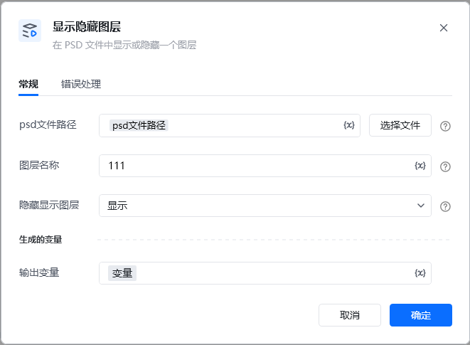
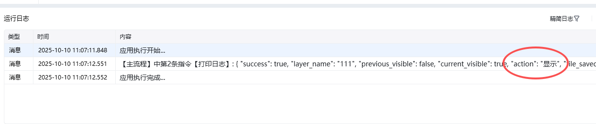
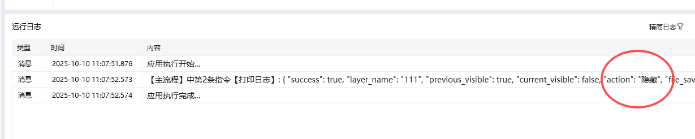

Photoshop 版本：Photoshop 版本支持2025✅2024✅2023✅2022✅2021✅2020✅CC2019✅CC2018✅CC2017✅
# # 显示/隐藏图层
### 描述

按图层名找到一个图层，显示或隐藏这个图层。
### 配置项说明
#### 输入

psd文件路径：

图层名： 图层名，可在ps里面查看图层名称

设置为： 设置为隐藏或者显示。

### 输出示例

\{

"success": true,

"layer_name": "111",

"previous_visible": true,

"current_visible": false,

"action": "隐藏",

"file_saved": true,

"file_path": "D:\\333.psd",

"file_name": "333.psd"

\}

<Info>
  使用指令过程中遇到问题？前往 [八爪鱼RPA 开发者社区问答板块](https://rpa.bazhuayu.com/community/questions) 提问，获取官方与社区帮助。
</Info>
