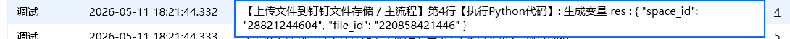

## <strong>一、指令概述</strong>

该指令用于将<strong>本地文件直接上传至钉钉钉盘</strong>指定文件夹，支持各类常见格式文件，上传成功后返回文件唯一 ID，适用于业务文档自动归档、报表同步、附件备份、批量文件上云等自动化场景。
## <strong>二、核心参数配置</strong>参数名称说明输入格式 / 规则凭证钉钉开放平台接口调用凭证（access_token）必填；通过「获取开发平台凭证」指令获取space_id钉盘空间 ID必填；通过「获取空间列表」指令获取，指定目标钉盘空间文件待上传的本地文件必填；选择本地文件路径，支持 .xlsx/.docx/.pdf/.jpg 等格式用户 Id操作人钉钉用户 ID必填；通过「查询用户 Id」指令获取文件夹 Id目标上传文件夹 ID必填；0 = 上传至空间根目录；填写具体 ID 则上传至指定子文件夹也可以通过指令《获取钉钉存储的文件或文件夹列表 》获取生成变量【文件 Id】输出结果变量必填；返回上传成功后的文件唯一 ID
## <strong>四、典型操作示例</strong>

· 凭证：ding_access_token_xxxx

· space_id：28821244604

· 文件：C:\报表\2026销售数据.xlsx

· 用户 Id：m4PgPMMZNiijuStvkgQxxx

· 文件夹 Id：22064576xxx

· 输出变量：upload_file_id

· 执行效果：将本地 Excel 报表上传至指定钉盘业务文件夹，返回文件 ID，完成自动归档。

输出结果：

## <strong>五、注意事项</strong>

1. <strong>权限校验</strong>：操作人必须拥有目标钉盘、文件夹的<strong>上传写入权</strong>

<Info>
  使用指令过程中遇到问题？前往 [八爪鱼RPA 开发者社区问答板块](https://rpa.bazhuayu.com/community/questions) 提问，获取官方与社区帮助。
</Info>
