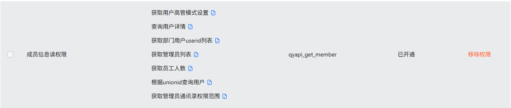

### 功能说明

使用 AppKey、AppSecret获取钉钉开发平台访问凭证（AccessToken）， 以便“钉钉扩展” 指令模块相关指令使用

参考 钉钉在线表格指令模块[钉钉在线表格指令模块](https://rpa.bazhuayu.com/helpcenter/docs/gM80NN) 创建钉钉应用

注意，“钉钉扩展” 指令模块需要创建的钉钉应用开通以下权限

<Info>
  使用指令过程中遇到问题？前往 [八爪鱼RPA 开发者社区问答板块](https://rpa.bazhuayu.com/community/questions) 提问，获取官方与社区帮助。
</Info>
