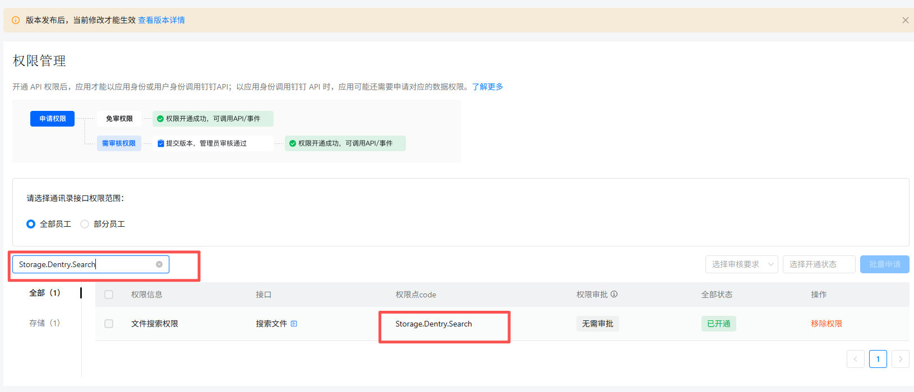
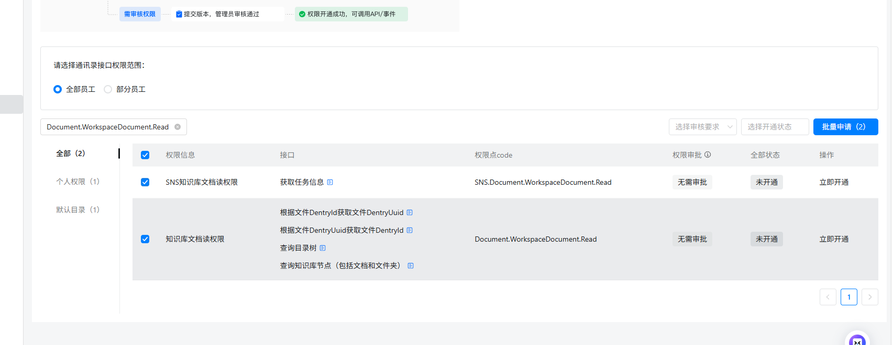

## 一、指令概述

本指令用于钉钉云盘（钉盘）检索，通过名称关键词模糊匹配目标文件 / 文件夹，自动分页遍历钉盘目录，批量返回匹配对象的全套唯一标识字段，输出结构化数组，为<strong>上传文件、获取文件链接、下载文件、目录管理</strong>等钉盘操作提供必填 ID 参数。

可参考链接： https://open.dingtalk.com/document/development/search-for-files?debug=true[https://open.dingtalk.com/document/development/search-for-files?debug=true](https://open.dingtalk.com/document/development/search-for-files?debug=true)
## 二、输入参数明细参数名称控件类型获取来源 & 填写规则参数作用凭证输入框由「获取开发平台凭证」指令获取 access_token钉钉开放接口鉴权凭证，必填Union_id输入框由「获取用户详情信息」指令获取用户唯一 UnionID检索操作人的身份标识，限定检索权限范围，必填关键词输入框填写文件 / 文件夹完整或模糊名称检索匹配关键字，支持模糊查询，匹配名称包含该文本的钉盘对象
## 三、输出参数输出变量名数据类型输出内容说明文件内容数据对象数组每条元素包含：文件 / 文件夹名称、全局唯一 dentryUuid、spaceId 空间 ID、传统 dentryId 文件 / 文件夹 ID
## 四、实操配置示例
场景：检索钉盘「Temu 物流对账」文件夹凭证：ding_access_token_xxxxUnion_id：m4PgPMMZNiijuStvkgQD2VAiEiE关键词：Temu物流对账输出变量：ding_file_list：[ \{ "name": "Temu物流对账", "dentryUuid": "pYLaezmVNe3XYG3DFPzxxxxxxWrMqPxX6", "spaceId": "28822xxxxx", "文件夹/文件ID": "22xxxxxxxx" \} ]

需开通以下俩个权限：

<Info>
  使用指令过程中遇到问题？前往 [八爪鱼RPA 开发者社区问答板块](https://rpa.bazhuayu.com/community/questions) 提问，获取官方与社区帮助。
</Info>
