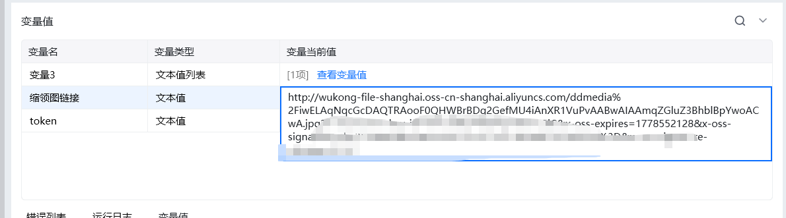

## <strong>一、指令概述</strong>

该指令用于调用钉钉开放平台接口，<strong>获取钉盘内图片类文件的缩略图在线访问链接</strong>，可用于图片预览、消息卡片展示、报表嵌入等场景，需配合「上传文件到钉钉文件存储」指令使用。

可查看文档： https://open.dingtalk.com/document/development/get-file-thumbnails-in-bulk?debug=true[https://open.dingtalk.com/document/development/get-file-thumbnails-in-bulk?debug=true](https://open.dingtalk.com/document/development/get-file-thumbnails-in-bulk?debug=true)
## <strong>二、核心参数配置</strong>参数名称说明输入格式 / 规则凭证钉钉开放平台接口调用凭证（access_token）必填；通过「获取开发平台凭证」指令获取用户 Id操作人钉钉用户 ID必填；通过「查询用户 Id」指令获取space_id钉盘空间 ID必填；通过「获取空间列表」指令获取文件 Id钉盘内目标文件唯一 ID必填；由「上传文件到钉钉文件存储」指令执行后返回生成变量【缩略图链接】输出结果变量必填；返回可直接访问的图片缩略图 URL 链接
## <strong>三、典型操作示例</strong>

· 凭证：ding_access_token_xxxx

· 用户 Id：m4PgPMMZNiijuStvkgQxxx

· space_id：2882124xxx

· 文件 Id：2206xxxx

· 输出变量：thumbnail_url

· 执行效果：返回图片在线缩略图链接，可直接在浏览器打开预览。

输出结果：

## <strong>四、注意事项</strong>

<Info>
  使用指令过程中遇到问题？前往 [八爪鱼RPA 开发者社区问答板块](https://rpa.bazhuayu.com/community/questions) 提问，获取官方与社区帮助。
</Info>
