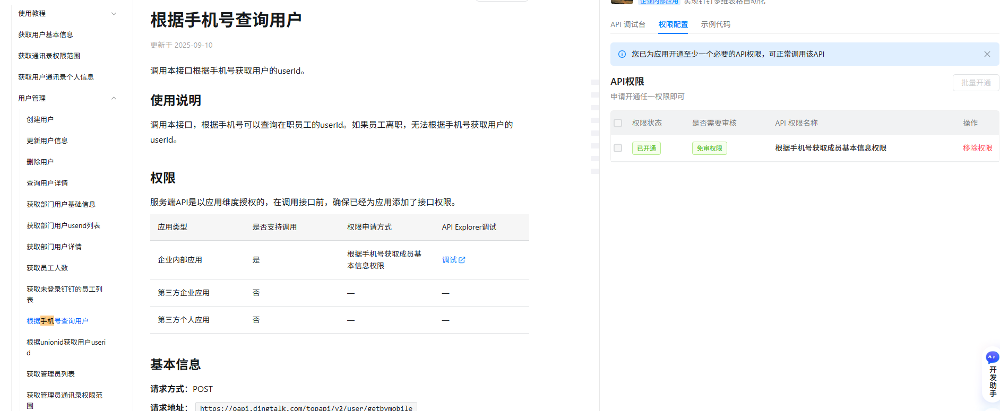

可查看官方文档： https://open.dingtalk.com/document/development/query-users-by-phone-number[https://open.dingtalk.com/document/development/query-users-by-phone-number](https://open.dingtalk.com/document/development/query-users-by-phone-number)

权限设置：

<Info>
  使用指令过程中遇到问题？前往 [八爪鱼RPA 开发者社区问答板块](https://rpa.bazhuayu.com/community/questions) 提问，获取官方与社区帮助。
</Info>
