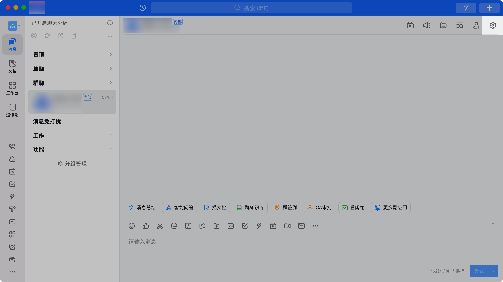
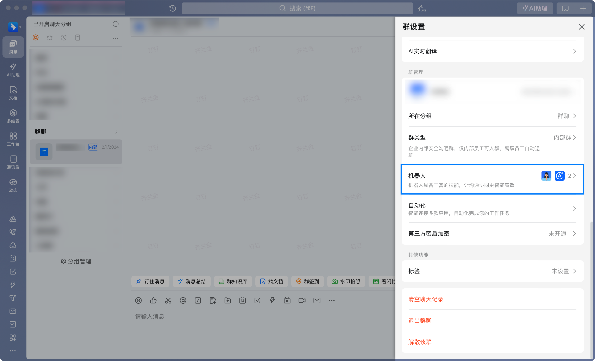

## 一、指令概述

通过钉钉 Webhook 机器人，将本地文件上传至钉钉存储后，支持 Markdown 格式的消息形式发送到指定钉钉群聊，适用于群内资料同步、通知推送等场景，可提升文件与消息结合的传播效率。
## 二、调用参数配置参数名称配置说明约束规则Webhook钉钉群机器人的 Webhook 连接地址，用于定位目标群聊必填；需在钉钉群机器人配置页面获取加签钉钉群机器人的 Webhook 加签密钥，用于接口请求校验必填消息标题推送消息的标题，用于快速识别内容主题必填消息内容推送消息的正文，支持 Markdown 格式排版必填；可包含文本、链接、列表等格式，用于补充说明文件信息文件待发送的本地文件，可通过 “选择文件” 按钮选取必填；需确保文件存在且具备读取权限，大小不超过钉钉存储限制开发平台凭证钉钉开放平台访问凭证，用于文件上传接口认证必填；可通过 “获取开发平台凭证” 指令获取，需确保凭证在有效期内文件夹 Id文件上传的目标钉钉存储文件夹 ID，0 表示用户存储空间根目录必填；可通过 “获取钉钉存储的文件夹列表” 指令获取用户 Id发送人的用户 ID，为一串随机字母必填；可通过 “获取用户详细信息” 指令获取@成员（高级）需 @的成员手机号码，多成员用分号分隔选填；仅需提醒特定成员时使用@所有人（高级）勾选后消息将 @群内所有成员选填；仅需全员提醒时使用
## 三、输出说明
## 四、典型操作示例
示例 1：发送项目报表并 @相关成员配置 “Webhook”：填入目标群机器人的 Webhook 地址；配置 “加签”：若机器人开启加签，填入对应密钥；配置 “消息标题”：输入 “【项目周报】12 月第 1 周进度”；配置 “消息内容”：用 Markdown 格式编写正文，如> 本周完成需求开发，详见附件报表；配置 “文件”：点击 “选择文件” 按钮，选取本地文件D:\项目周报.xlsx；配置 “开发平台凭证”：通过 “获取开发平台凭证” 指令获取并填入；配置 “文件夹 Id”：填入目标文件夹 Id（如0）；配置 “用户 Id”：填入发送人的用户 Id；配置 “@成员”：输入需提醒的成员手机号（如138xxxx1234;139xxxx5678）；执行指令后，文件将上传至钉钉存储，将消息发送到目标群并 @指定成员。
六、注意事项<strong>参数配置约束</strong>：Webhook、开发平台凭证、文件夹 Id、用户 Id 均为必填项，需确保格式与来源准确；凭证过期需重新获取；<strong>权限相关</strong>：若提示 “无权限”，需检查机器人配置权限、文件夹上传权限，或联系管理员配置钉钉开放平台接口权限；<strong>操作权限</strong>：需具备钉钉群机器人的配置权限、钉钉开放平台接口调用权限；用户 Id 对应的账号需拥有目标文件夹的上传权限；
## <strong>配置注意事项：</strong>
- <strong>操作步骤（可参考的链接  </strong>创建自定义机器人[创建自定义机器人](https://open.dingtalk.com/document/orgapp/robot-overview?spm=a2q3p.21071111.0.0.45c96dXf6dXfnV ) <strong>）</strong>登录钉钉客户端，选择需要添加机器人的群聊会话。进入群聊会话，单击右上角群设置标识。

- 在群管理栏，单击机器人 > 添加机器人，选择自定义机器人。

<Info>
  使用指令过程中遇到问题？前往 [八爪鱼RPA 开发者社区问答板块](https://rpa.bazhuayu.com/community/questions) 提问，获取官方与社区帮助。
</Info>
