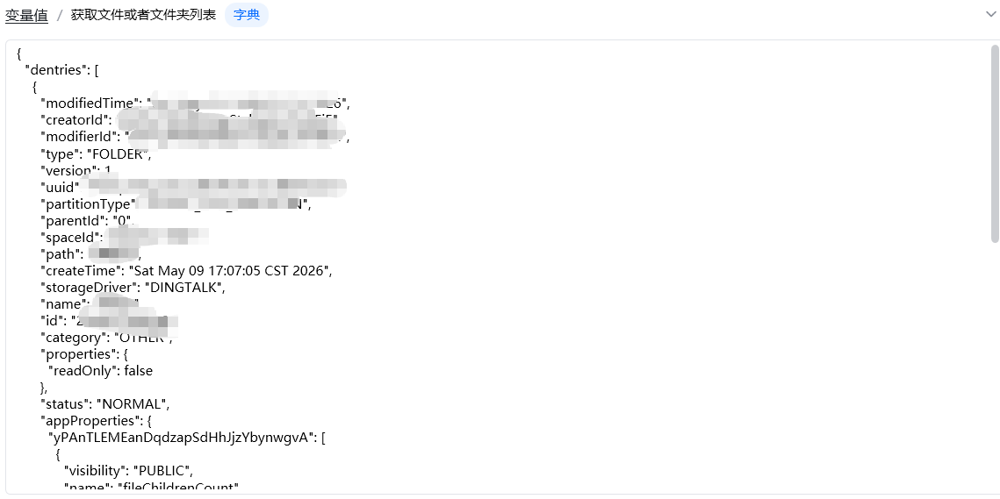
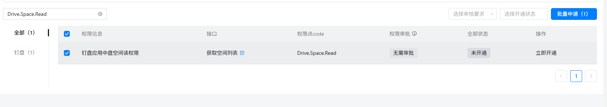

## <strong>一、指令概述</strong>

该指令用于调用钉钉开放平台 API，获取<strong>指定钉盘空间、指定父目录下的所有文件与子文件夹列表</strong>，支持分页查询，返回结构化 JSON 数据，适用于钉盘文件遍历、批量下载、目录同步、文件监控等自动化场景。

可查看官方文档： https://open.dingtalk.com/document/development/get-a-list-of-files-or-folders[https://open.dingtalk.com/document/development/get-a-list-of-files-or-folders](https://open.dingtalk.com/document/development/get-a-list-of-files-or-folders)
## <strong>二、核心参数配置</strong>参数名称说明输入格式 / 规则凭证钉钉开放平台接口调用凭证（access_token）必填；通过「获取开发平台凭证」指令获取用户 Id操作人的钉钉用户 ID必填；为一串数字，可通过「查询用户 Id」指令或钉钉管理后台 - 通讯录获取space_id钉盘空间 ID必填；通过「获取空间列表」指令获取，用于指定要访问的钉盘空间父目录 Id目标目录 ID必填；0代表用户空间根目录，填写具体 ID 则查询对应子目录next_token分页查询标识选填；首次查询留空；分页查询时，传入上一轮接口返回的next_token，获取下一页数据生成变量【获取文件或者文件夹列表】存储查询结果的输出变量必填；返回字典格式，包含文件 / 文件夹明细列表、分页标识等信息
## <strong>三、典型操作示例</strong>
### <strong>示例：查询钉钉钉盘根目录文件列表</strong>

· 凭证：ding_access_token_xxxx

· 用户 Id：m4Pxxxxxxxxxx

· space_id：xxxxxxxx

· 父目录 Id：0

· next_token：（留空）

· 输出变量：ding_file_list

· 执行效果：返回该钉盘空间根目录下<strong>所有文件、文件夹</strong>的完整信息
#### 输出结果：

## <strong>四、注意事项</strong>

1. <strong>权限校验</strong>：操作人必须拥有目标钉盘空间、目录的<strong>查看权限</strong>，否则返回无权限报错；

2. <strong>分页逻辑</strong>：钉盘接口单次返回数据有限，文件较多时需通过next_token循环分页；

3. <strong>数据区分</strong>：通过type字段区分文件（FILE）与文件夹（FOLDER），可用于递归遍历子目录；

权限：这俩个权限记得要开

<Info>
  使用指令过程中遇到问题？前往 [八爪鱼RPA 开发者社区问答板块](https://rpa.bazhuayu.com/community/questions) 提问，获取官方与社区帮助。
</Info>
