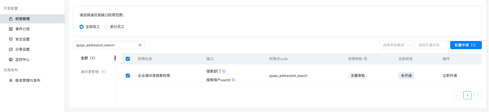

一、指令概述

该指令用于调用钉钉开放平台接口，<strong>根据用户姓名关键词查询对应用户 ID</strong>，最多返回 10 个匹配结果，获取的用户 Id 可直接用于钉盘、消息发送等后续钉钉相关自动化指令，是钉钉生态自动化流程的基础前置指令。
## <strong>二、核心参数配置</strong>参数名称说明输入格式 / 规则凭证钉钉开放平台接口调用凭证（access_token）必填；通过「获取开发平台凭证」指令获取关键词待查询的用户姓名（支持模糊匹配）必填；输入员工姓名，支持部分字符模糊搜索生成变量【用户 Id 列表】存储查询结果的输出变量必填；返回字符串列表，包含匹配到的所有用户 Id，最多 10 个
## <strong>三、典型操作示例</strong>

•凭证：ding_access_token_xxxx

•关键词：张三

•输出变量：ding_user_id_list

•执行效果：返回匹配姓名为张三的用户 Id 列表，如["m4PgPMMZNiijuSxxxxx","xxx"]，最多 10 个结果。

四、注意事项

1.<strong>权限要求</strong>：调用凭证需具备钉钉通讯录用户查询权限，否则查询失败。

2.<strong>匹配规则</strong>：支持模糊查询，输入姓名片段即可匹配；同名人员较多时，最多返回 10 个结果。

<Info>
  使用指令过程中遇到问题？前往 [八爪鱼RPA 开发者社区问答板块](https://rpa.bazhuayu.com/community/questions) 提问，获取官方与社区帮助。
</Info>
