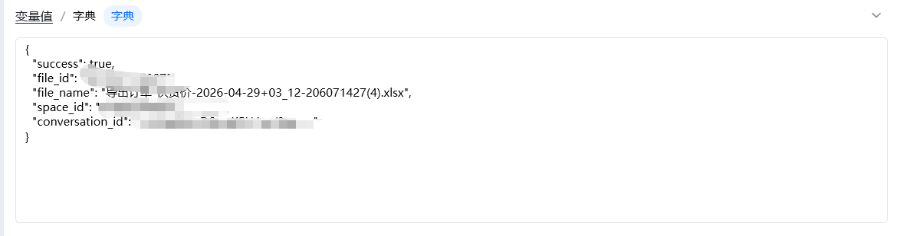
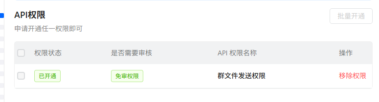

## <strong>一、指令概述</strong>

该指令实现<strong>一键将本地文件上传钉盘 + 发送至指定钉钉用户</strong>的一体化操作，自动完成「上传钉盘→获取文件 ID→发送私聊文件」全流程，无需拆分多步指令，适用于报表推送、附件下发、自动通知、批量文件分发等场景。
## <strong>二、核心参数配置</strong>参数名称说明输入格式 / 规则凭证钉钉开放平台接口调用凭证（access_token）必填；通过「获取开发平台凭证」指令获取文件待发送的本地文件必填；填写本地文件绝对路径，支持xlsx、docx、pdf、图片等格式用户 Id接收方钉钉用户 ID必填；通过「查询用户 Id」指令获取，为文件接收人space_id钉盘空间 ID必填；通过「获取空间列表」指令获取，文件临时上传的钉盘空间文件夹 Id钉盘上传目录 ID必填；0 = 上传至空间根目录；填写具体 ID 则上传至指定子文件夹生成变量执行结果输出变量必填；返回字典格式，包含发送状态、文件 ID、消息 ID，用于判断发送是否成功
## <strong>三、典型操作示例</strong>

· 凭证：ding_access_token_xxxx

· 文件：C:\业务报表\2026销售周报.xlsx

· 用户 Id：m4PgPMMZNiijuStvkgQDxxxxxx（接收人）

· space_id：28821xxx244604

· 文件夹 Id：22064xxxx

· 输出变量：send_file_result

· 执行效果：自动将周报上传至钉盘指定目录，并私聊发送给目标用户。

输出结果：

## <strong>四、注意事项</strong>

1. <strong>权限校验</strong>：应用需开启<strong>钉盘上传权限、钉钉私聊发送权限</strong>；接收用户 ID 必须正确；

<Info>
  使用指令过程中遇到问题？前往 [八爪鱼RPA 开发者社区问答板块](https://rpa.bazhuayu.com/community/questions) 提问，获取官方与社区帮助。
</Info>
